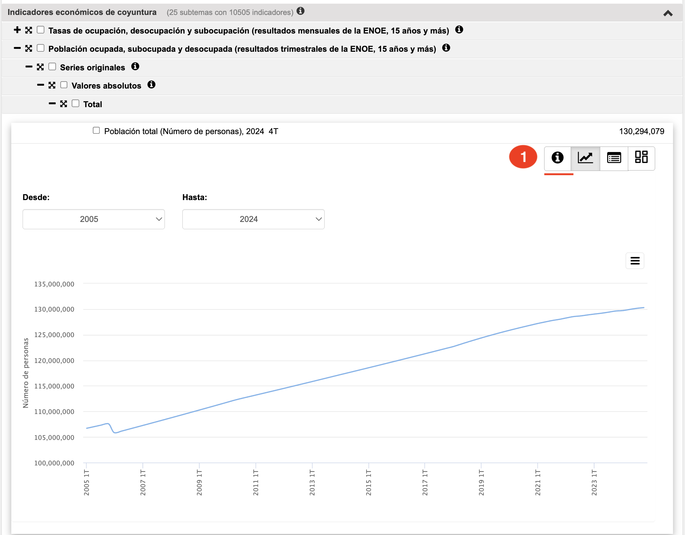
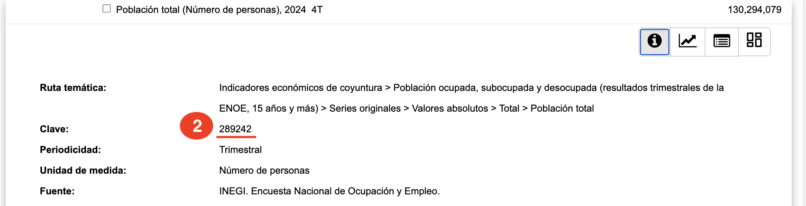
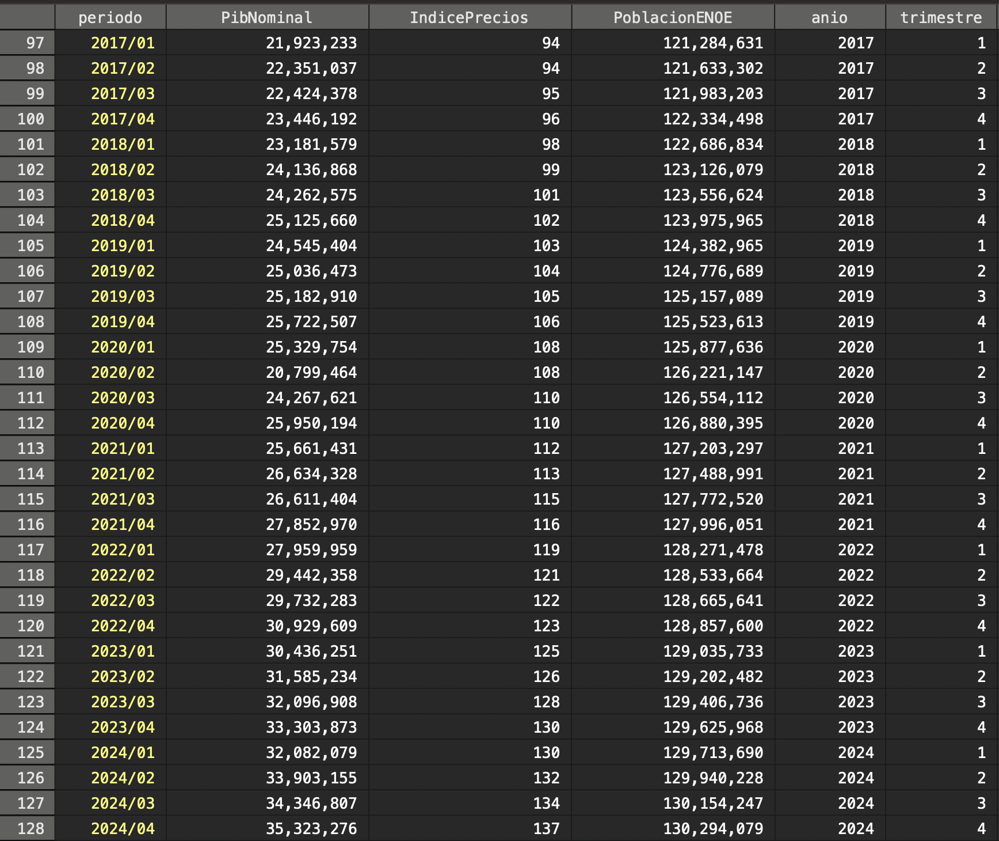

# Simulador Fiscal CIEP: Acceso BIE

Versión: 4 de abril de 2025


<hr style="border: none; height: 2px; background-color: #ff7020;">

## AccesoBIE.ado
**Descripción**: *Ado-file* diseñado para cargar series de los datos disponibles en el Banco de Información Económica. 

**Alcance**: Este programa facilita las tareas de consulta y análisis de datos sin necesidad de descargar las series manualmente.


<h3 style="color: #ff7020;">1. Input:</h3>

Se utiliza una fuente de datos:

Banco de Información Económica:  Proporciona datos económicos sobre PIB, el deflactor de precios, la inflación, el empleo y muchos otros más[^1] 

<h3 style="color: #ff7020;">2. Sintaxis:</h3>

Para cargar los datos, es necesario ingresar el comando en la consola siguiendo esta sintaxis:

`AccesoBIE "clave" "nombre"`

**Descripción de cada termino:**

`AccesoBIE: ` Este comando llama al programa.

`clave:` Aquí ingresa las claves de los indicadores económicos que deseas ingresar

`nombre:` Aquí ingresa los nombre con los guardaras la variable del indicador económico. Puede escribir el que desees

**Ejemplo de uso**:
Este comando carga en Stata 3 indicadores: PIB a precios corrientes, el Indice de Precios Implicítos y la población total de la ENOE. 

`AccesoBIE "734407 735143 446562" "PibNominal IndicePrecios PoblacionENOE"`


<details>
  <summary>**Instrucciones para localizar series del Banco de Información Económica**</summary>

Pasos para encontrar código de la serie:

1. Ingresa a [Banco de Información Económica (BIE)](https://www.inegi.org.mx/app/indicadores/default.aspx?tm=0#tabMCcollapse-Indicadores)

2. Busca el indicador económico. En este caso se está eligiendo "Población ocupada, subocupada y desocupada". 
<div style="display: flex; justify-content: center; align-items: center;">
    
</div>

3. Localiza el código de la serie y copialo.
<div style="display: flex; justify-content: center; align-items: center;">
    
</div>
 
  
</details>


<h3 style="color: #ff7020;">3. Output:</h3>

Tras ingresar el comando, el código te devolverá una base de datos con los indicadores solicitados. El código agregará variables de fechas para hacer más fácil la interpretación.

**Ejemplo: Base de Datos** 
 
<div style="display: flex; justify-content: center; align-items: center;">
    
</div>
 


[^1]: **Link:** [Banco de Indicadores](https://www.inegi.org.mx/app/indicadores/)

---

<h3 style="color: #ff7020;">4. Información técnica:</h3>

**A. Sintaxis completa:**
```stata
AccesoBIE serie1 [serie2 ...] [, nombres(string) token(string)]
```
- `serie1 serie2 ...`: Códigos de series del BIE (pueden ser múltiples)
- `nombres()`: Nombres personalizados para variables (opcional)
- `token()`: Token de acceso API (opcional, incluye token predeterminado CIEP)

**B. Variables generadas automáticamente:**
- `anio`: Año extraído del período
- `mes`: Mes (si la serie es mensual)
- `trimestre`: Trimestre (si la serie es trimestral)
- `subperiodo`: Otros tipos de períodos
- Variables con datos: Nombres automáticos (v[serie]) o personalizados

**C. Métodos de descarga (automático con fallback):**
1. **API oficial INEGI**: Intenta primero con BIE, luego BISE
2. **Web scraping**: Si la API falla, extrae datos del portal de exportación
3. **Sistema de reintentos**: Hasta 3 intentos con 2 segundos de espera

**D. Procesamiento automático de datos:**
- **Limpieza de períodos**: Elimina sufijos /p1, /r1, /p, /r
- **Conversión de tipos**: Strings numéricos → números, manejo de "N/E" y "ND"
- **Detección automática de frecuencia**: Anual, trimestral, mensual
- **Limpieza de nombres**: Solo caracteres válidos para variables Stata
- **Etiquetas descriptivas**: Extrae nombres completos del INEGI

**E. Archivos temporales generados:**
- `03_temp/AccesoBIE/[serie].csv`: Archivos CSV por serie descargada
- Las series múltiples se combinan automáticamente por período

**F. Ejemplo de uso avanzado:**
```stata
// Una serie con nombre automático
AccesoBIE 628194

// Múltiples series con nombres personalizados  
AccesoBIE "734407 735143 446562", nombres(PIBNominal InflacionAnual PoblacionENOE)

// Con token personalizado
AccesoBIE 628194, token(mi-token-personalizado)
```

**G. Series comunes del BIE:**
- `628194`: PIB a precios corrientes
- `734407`: PIB nominal
- `735143`: Índice de precios implícitos
- `446562`: Población ENOE
- `444612`: Tasa de desocupación
- Más de 200,000 series disponibles en el BIE

**H. Manejo de errores:**
- Archivos vacíos si no se encuentran datos
- Nombres de variables por defecto (v[serie])
- Mensajes informativos durante descarga
- Reintentos automáticos por problemas de conectividad

**I. Integración con Python:**
- Requiere Python con librerías: `requests`, `json`, `beautifulsoup4`
- Sistema híbrido Stata-Python para robustez
- Timeout de 30-60 segundos para conexiones
- Codificación UTF-8 para caracteres especiales

**J. Variables globales temporales:**
- `${INEGI_VARNAME_[serie]}`: Nombre de variable por serie
- `${INEGI_LABEL_[serie]}`: Etiqueta descriptiva por serie
- Se limpian automáticamente al finalizar 
