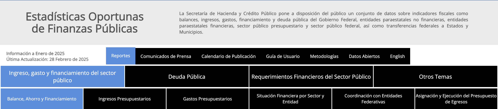
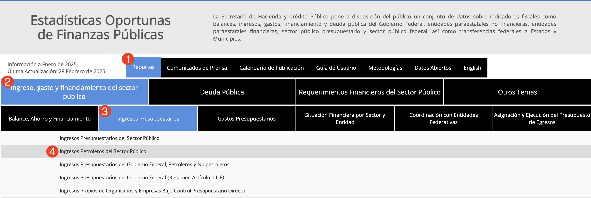
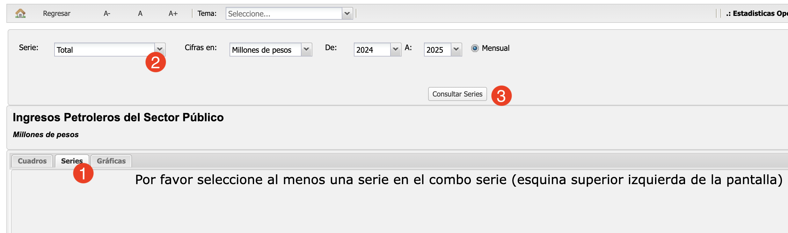
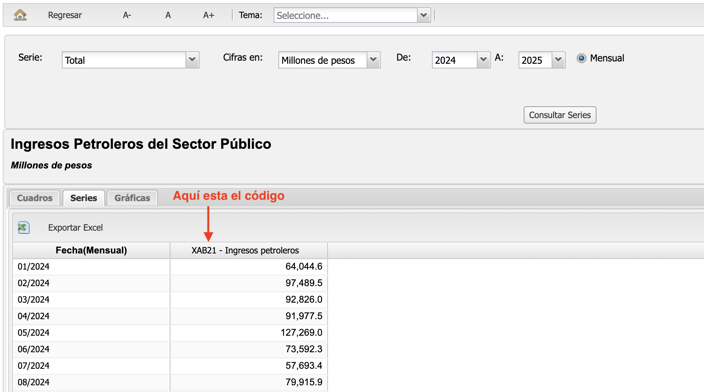
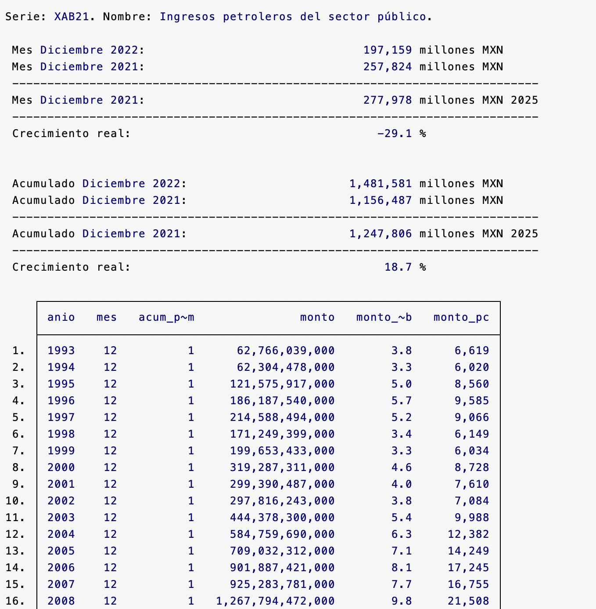
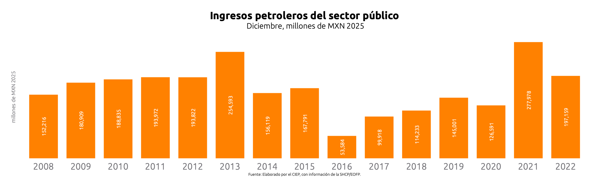
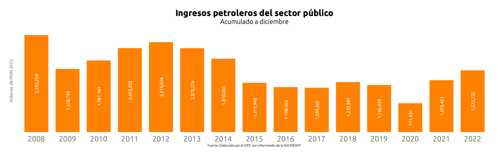
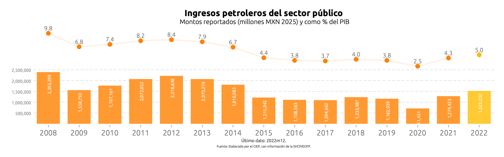
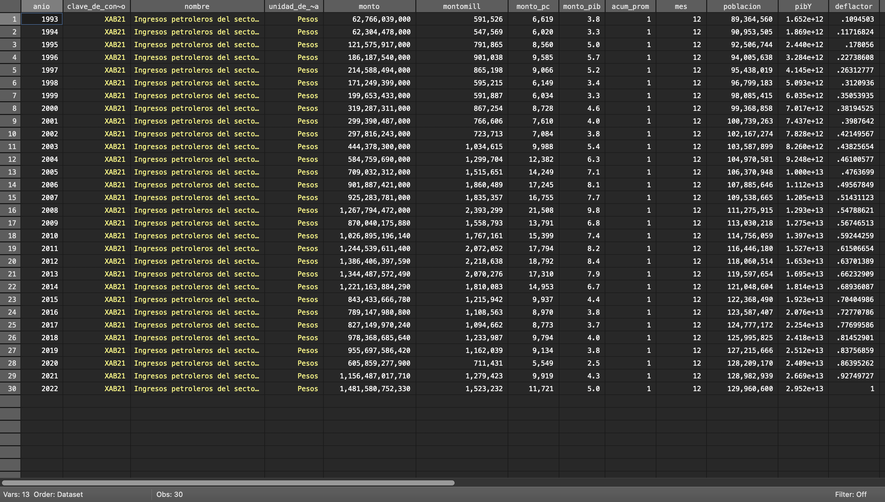

# Simulador Fiscal CIEP: Datos abiertos

Versión: 6 de marzo de 2025

## DatosAbiertos.ado
**Descripción:** *Ado-file* diseñado para proporcionar acceso estructurado y sistematizado a todos los datos de las *Estadísticas Oportunas de Finanzas Públicas*, para facilitar su consulta y análisis. Para este programa se utilizan datos de la Secretaría de Hacienda y Crédito Público (SHCP) y de INEGI.

 

**Alcance:** Este programa permite acceder a cualquier indicador económico de la SHCP, facilitando la descarga y el analisis. Además, el programa utiliza indicadores de otros *Ado-files* para hacer precálculos con los indicadores.

**Fusiones con otros Ado-files**:

*Poblacion.ado* : Genera una variable que muestra el valor del indicador seleccionado per cápita.

*PIBDeflactor.ado* : Tiene dos funcionalidades: permite mostrar el monto del indicador en relación con el tamaño de la economía y ajusta los valores para hacerlos comparables en el tiempo

<h3 style="color: #ff7020;">1. Input:</h3>

En este programa se utilizan tres fuentes de datos: 

1. Estadísticas Oportunas de Finanzas Públicas:  Proporciona información sobre finanzas públicas del país, incluyendo balances fiscales, ingresos, gastos y deuda pública. [^1]

2. Población CONAPO: Contiene la estimación del número de habitantes a mitad de cada año entre 1950 y 2070.[^2]

3. BIE: Proporciona datos sobre el PIB, el deflactor de precios, la inflación y el empleo. [^3] 

<h3 style="color: #ff7020;">2. Sintaxis:</h3>

Este programa tiene una sintaxis distinta a los demás, el valor `[anything]` permite acceder a diversos indicadores económicos.

Esta es la sintaxis que debe seguir el prompt:

`[anything] [if] [, DESDE(int) UPDATE NOGraphs PROYeccion]`

Para crear comandos de manera automática y evitar errores de sintaxis, utiliza nuestra calculadora de prompts.

**A. Escoge la serie**

  <label for="Serie">Serie:</label>
  <select id="Serie" onchange="actualizarComando()">
    <option value="XED10">Deuda Interna del Sector Público Federal</option>
    <option value="XEB00">Deuda Externa del Sector Público Federal</option>
    <option value="XAA">Balance Público</option>
    <option value="XAA30">Balance Primario</option>
    <option value="XAB">Ingresos Presupuestarios</option>
    <option value="XAC">Gasto Público Neto Pagado</option>
    <option value="">Otro (Ingresa la serie manualmente)</option>
  </select>

  
**Instrucciones para localizar series de Estadísticas Oportunas**

  
Podrás elegir cualquier serie dentro de las Estadísticas Oportunas de Finanzas Públicas (ESTOPOR).

Pasos para encontrar código de la serie:

1. Ingresa a [ESTOPOR](http://presto.hacienda.gob.mx/EstoporLayout/estadisticas.jsp)

2. Busca el reporte de tu preferencia. En este caso se está eligiendo Ingresos Petroleros del Sector Público
 
3. Elige la serie.

3. Copia y pega el código de la serie despues de `Datos Abiertos`
 

  

**B. Escoge opciones**

  <label for="desde">Año de comparación:</label>
  <input type="number" id="desde" placeholder="Ej. 2008" oninput="actualizarComando()">

  <label for="noGraphs">Sin gráficos:</label>
  <input type="checkbox" id="noGraphs" onchange="actualizarComando()">

  <label for="update">Actualizar base:</label>
  <input type="checkbox" id="update" onchange="actualizarComando()">

  <label for="proyeccion">Proyección:</label>
  <input type="checkbox" id="proyeccion" onchange="actualizarComando()">

  
**Descripción de opciones:**

  
 - **Año de comparación (desde)**: Especifica el año desde donde empezará la gráfica. El valor por default es el 2008.
- **Sin Gráficos (nographs)**: Evita la generación de gráficas.
- **Actualizar Base (update)**: Corre un *do.file* para obtener los datos más recientes del SHCP. 
- **Proyección (Proyección)**: Determina como se manejan los datos faltantes. Al seleccionar Proyeccion, los valores se completan utilizando la tendencia del periodo analizado.

  

<strong>Copia y pega este comando en la consola:</strong>

<pre id="códigoComando">DatosAbiertos XED10</pre>

<h3 style="color: #ff7020;">3. Output:</h3>

Tras ingresar el prompt, el código devolverá cuatro elementos. La ventana de resultados, tres gráficas y una base de datos. 

**1. Ventana de Resultados:** 

  
**2. Gráficas:** 

A. Desglose mensual: Detalla el registro mensual de ingresos petroleros.

B. Registro último mes: Muestra los ingresos registrados en el último mes disponible de cada año.

C. Registro anual: Registra el ingreso acumulado hasta el último mes disponible.

D. Registro anual (% del PIB): Muestra el ingreso recibido en cada año y su proporción en relación con el PIB. Para el año en curso, muestra los ingresos acumulados hasta la fecha.

**3. Base de Datos:** Permite obtener una base de datos recortada y limpia para hacer sus propios análisis.

  
**Información sobre la base de datos**

  
 1. Información sobre los valores: Todos los montos en la base de datos son en valor nominal, salvo que se indique lo contrario. La información de las cifras proviene directamente de fuentes públicas.

 

[^1]: **Link:** [Estadísticas Oportunas](http://presto.hacienda.gob.mx/EstoporLayout/estadisticas.jsp) 

[^2]: **Link:** [Bases de Datos CONAPO](https://www.gob.mx/conapo/articulos/reconstruccion-y-proyecciones-de-la-poblacion-de-los-municipios-de-mexico)

[^3]: **Link:** [Banco de Indicadores](https://www.inegi.org.mx/app/indicadores/)

---

<h3 style="color: #ff7020;">4. Información técnica:</h3>

**A. Variables generadas automáticamente:**
- `montomill`: Monto en millones de pesos nominales
- `monto_pc`: Monto per cápita en pesos reales (base año actual)
- `monto_pib`: Monto como % del PIB
- `deflactor`: Factor de deflactación (INPC base = mes más reciente)
- `deflactoracum`: Deflactor promedio acumulado por año
- `deflactormes`: Deflactor del mes específico
- `poblacion`: Población total por año (de CONAPO)
- `pibY`: PIB anual (promedio trimestral)
- `propmensual`: Proporción mensual dentro del año
- `acum_prom`: Acumulado promedio por mes

**B. Tipos de datos procesados:**
- **Flujo**: Ingresos, gastos, transacciones mensuales
- **Saldo**: Deuda, saldos acumulados, posiciones de balance

**C. Cálculos automáticos mostrados:**
Para series de **Flujo**:
- Comparación del último mes vs año anterior (nominal y real)
- Comparación acumulada hasta el último mes vs año anterior
- Tasas de crecimiento real interanual

Para series de **Saldo**:
- Saldo al último mes disponible vs diciembre anterior
- Saldo deflactado a pesos constantes
- Crecimiento real del saldo

**D. Archivos de salida:**
- `04_master/DatosAbiertos.dta`: Base completa de todas las series ESTOPOR
- `04_master/Deflactor.dta`: Deflactores mensuales (INPC)
- `04_master/Poblaciontot.dta`: Población total anual
- Gráficos PNG en carpeta `users/$id/graphs/`:
  - `M[serie].png`: Desglose mensual
  - `[Mes][serie].png`: Último mes por año
  - `A[serie].png`: Acumulado anual
  - `PIBA[serie].png`: Acumulado anual como % del PIB

**E. Dependencias:**
- `PIBDeflactor`: Obtiene deflactores y PIB trimestral
- `UpdateDatosAbiertos`: Descarga datos de ESTOPOR/SHCP
- `UpdateDeflactor`: Actualiza INPC mensual

**F. Series comunes disponibles:**
- `XED10`: Deuda interna del sector público federal
- `XEB00`: Deuda externa del sector público federal
- `XAA`: Balance público
- `XAA30`: Balance primario
- `XAB`: Ingresos presupuestarios
- `XAC`: Gasto público neto pagado
- Más de 500 series adicionales en ESTOPOR

**G. Opciones de proyección:**
- Cuando se especifica `proyeccion`, los valores faltantes se completan usando tendencias del período analizado
- Los datos se extienden hasta diciembre usando patrones estacionales históricos

**H. Monedas y escalas:**
- Montos originales: Miles de pesos nominales
- Display: Millones de pesos (nominal y real)
- PIB: Porcentajes del PIB anual
- Per cápita: Pesos reales por habitante 

