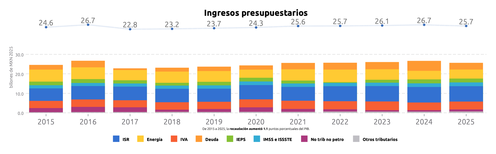
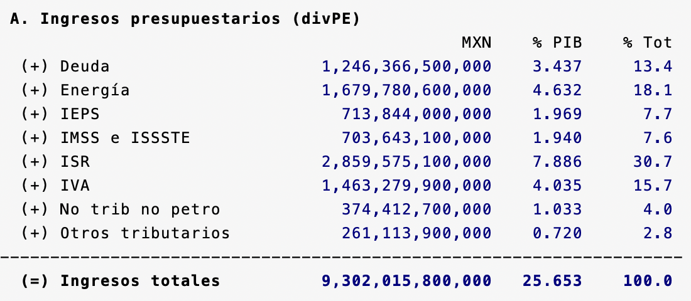
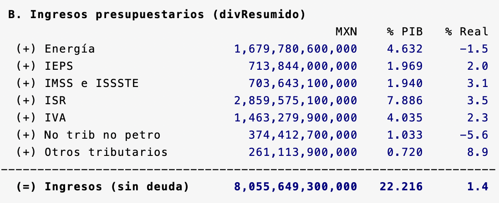
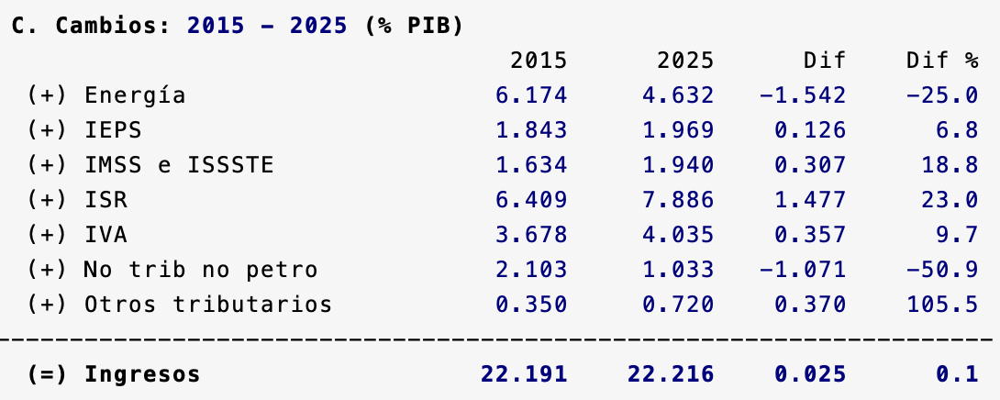
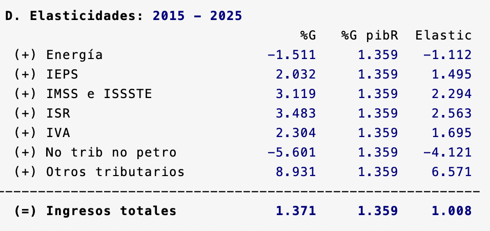
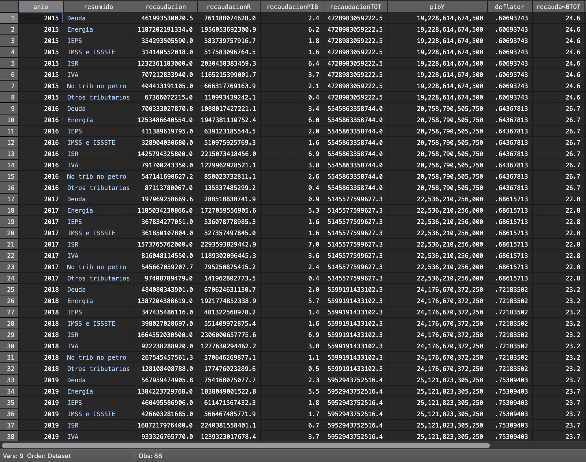

# Simulador Fiscal CIEP: LIF

Versión: 27 de febrero de 2025

## LIF.ado
**Descripción**: *Ado-file* diseñado para automatizar la extracción y el análisis de datos de los ingresos de la federación. Para este programa se utilizan datos oficiales de la SHCP y el INEGI.

Podrás acceder a los ingresos fiscales históricos para cualquier año, comparar su evolución a lo largo del tiempo y analizar su elasticidad en relación con el PIB. 

Además, la herramienta permite personalizar las gráficas para ajustarlas a tus necesidades de visualización

<h3 style="color: #ff7020;">1. Input:</h3>

En este programa se utilizan tres fuentes de datos:

1. LIF: Ley con los montos aprobados para la recaudación de impuestos. [^1]
2. Estadísticas Oportunas de la SHCP: Proporciona información sobre finanzas públicas del país, incluyendo balances fiscales, ingresos, gastos y deuda pública.[^2]
3. BIE:  Proporciona datos sobre el PIB y el deflactor de precios. [^3]

<h3 style="color: #ff7020;">2. Sintaxis:</h3>

Para extraer los datos, ingresa el prompt en la consola siguiendo esta sintaxis:

`LIF [, ANIO(int) DESDE(int) EOFP PROYeccion NOGraphs UPDATE]`

Para crear comandos de manera automática y evitar errores de sintaxis, utiliza nuestra calculadora de prompts.

    <h4 style="border-bottom: 2px solid black; display: inline-block;">Calculadora de Prompts</h4>

**A. Opciones disponibles:**
<!-- Opciones para LIF -->

<!-- Opcion1 -->

  <label for="anioVp">Año Base:</label>
  <input 
    type="number" 
    id="anioVp" 
    placeholder="Ej. 2024" 
    oninput="actualizarComando()">

<!-- Opcion2 -->

  <label for="desde">Año de comparación:</label>
  <input 
    type="number" 
    id="desde" 
    placeholder="Ej. 2013" 
    oninput="actualizarComando()">

<!-- Opcion3-->

  <label for="opcionProyeccion">Manejo datos faltantes:</label>
  <select id="opcionProyeccion" onchange="actualizarComando()">
    <option value="">-- Selecciona una opción --</option>
    <option value="proyeccion">Proyección</option>
    <option value="eofp">Sin proyección</option>
  </select>

<!-- Opcion4-->

  <label for="noGraphs">Sin gráficos:</label>
  <input type="checkbox" id="noGraphs" onchange="actualizarComando()">

<!-- Opcion5-->

  <label for="update">Actualizar base:</label>
  <input type="checkbox" id="update" onchange="actualizarComando()">

<!-- Opcion6-->

  <label for="base">Solo base:</label>
  <input type="checkbox" id="base" onchange="actualizarComando()">

  
**Descripción de opciones**:

- **Año Base (anio)**: Cambia el año de referencia. Tiene que ser un número entre 1993 y el año actual, que es el valor default.
- **Año de comparación (desde)**: Especifica el año con el que se compararán los datos. El valor por default son 10 años anteriores al año base.
- **Manejo Datos Faltantes (Proyección/EOFP)**: Determina cómo se manejan los datos faltantes. Al seleccionar *Proyeccion*, los valores se completan utilizando la tendencia del periodo analizado. Al seleccionar *EOFP*, los datos se muestran tal como están.  
- **Sin Gráfico (nographs)**: Evita la generación de gráficas.
- **Actualizar Base (update)**: Corre un *do.file* para obtener los datos más recientes del SHCP y el INEGI. 
- **Solo Base (base)**:  Permite descargar únicamente la base de datos sin aplicar cálculos adicionales.

<!--PERSONALIZACIÓN DE GRÁFICAS -->

    <h4 style="border-bottom: 2px solid black; display: inline-block;">Personalización de gráfica</h4>

<!-- Opcion7-->

  <label for="minimum">Rango mínimo:</label>
  <input type="number" id="minimum" step="0.1" placeholder="Ej. 0.5" oninput="actualizarComando()">

<!-- Opcion8-->

  <label for="rows">Filas:</label>
  <input type="number" id="rows" placeholder="Ej. 1" oninput="actualizarComando()">

<!-- Opcion9-->

  <label for="cols">Columnas:</label>
  <input type="number" id="cols" placeholder="Ej. 5" oninput="actualizarComando()">

<!-- Opcion10-->

  <label for="title">Título:</label>
  <input type="text" id="title" placeholder="Ej. Ingresos Fiscales" oninput="actualizarComando()">

  
**Descripción de opciones**:

- **Rango mínimo (minimum)**: Es el porcentaje mínimo del PIB que un rubro tiene que alcanzar para mostrarse en la gráfica. A mayor valor, mayor cantidad de conceptos caen dentro del rubro "otros". El valor default es (0.25)
- **Filas (rows)**: Modifica el número de filas en la leyenda en la gráfica.
- **Columna (cols)**: Modifica el número de columnas como leyenda en la gráfica
- **Título (title)**: Modifica el título de la gráfica.

<strong>Copia y pega este comando en la consola:</strong>

<pre id="códigoComando">LIF</pre>

<!-- Empieza codigo en JavaScript-->

<h3 style="color: #ff7020;">3. Output:</h3>

Tras ingresar el prompt, el código devolverá tres elementos: ventana de resultados, una gráfica y la base de datos. Podrás modificar el *ado.file* para obtener una base a tus necesidades. 

**1. Ventana de Resultados:** Muestra 4 tablas con información de los ingresos de la federación.

Tabla A: Contiene los ingresos estimados, clasificados según su origen.

Tabla B: Contiene los ingresos estimados excluyendo deuda, clasificados según su origen. En la última columna a la derecha, se muestra el porcentaje de cambio desde el periodo comparado.

Tabla C: Compara la evolución de los ingresos presupuestarios como porcentaje del PIB entre los diferentes años seleccionados.

Tabla D: Calcula el crecimiento por rubro y lo compara con el crecimiento del PIB para el mismo periodo. Además, analiza la elasticidad entre las dos figuras.

 

**2. Gráficas:** Representación visual de los indicadores calculados. 

Muestra la evolución de los ingresos presupuestarios en el periodo de tiempo seleccionado.

**3. Base de Datos:** Permite al usuario obtener una base de datos recortada y limpia para hacer sus propios análisis.

   
  

  
**Información sobre la base de datos**

  
 1. Información sobre los valores: Todos los montos en la base de datos son en valor nominal, salvo que se indique lo contrario. La información de las cifras proviene directamente de fuentes públicas.
 2. En el caso de que selecciones la opción 
`solo base`, el programa te devolverá una base de datos sin ningún tipo de procesamiento. Se desplegará exactamente igual que en fuentes públicas. Consideramos que esta es una buena opción si quieres empezar tus análisis desde cero. 

[^1]: **Link:** [Ley Federal de Ingresos](https://www.finanzaspublicas.hacienda.gob.mx/es/Finanzas_Publicas/Paquete_Economico_y_Presupuesto) 

[^2]: **Link:** [Estadísticas Oportunas](http://presto.hacienda.gob.mx/EstoporLayout/estadisticas.jsp) 

[^3]: **Link:** [Banco de Indicadores](https://www.inegi.org.mx/app/indicadores/) 

