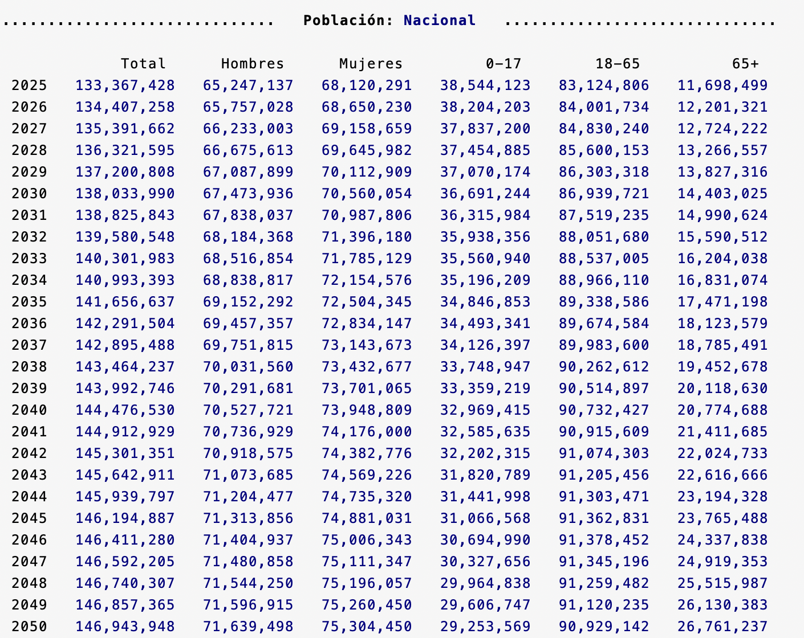

# Simulador Fiscal CIEP: Población y sus proyecciones

Versión: 22 de marzo de 2025

## ARCHIVO: Poblacion.ado

**Descripción:** *Ado-file* que automatiza la extracción de datos de las Proyecciones de la Población de México del CONAPO. 

  
**Conoce la lista de variables generadas**

  
  * **Población:** Muestra los datos de población históricos y su proyección hasta 2070 por sexo, edad, año y entidad federativa.

<h3 style="color: #ff7020;">1. Bases de datos iniciales (inputs):</h3>

En este programa se integran tres bases de datos del CONAPO:[^1]

1. Población: Contiene la estimación del número de habitantes a mitad de cada año entre 1950 y 2070.
2. Defunciones: Contiene la estimación de las defunciones anuales entre 1950 y 2070. 
3. Migración Internacional: Contiene la estimación del número de inmigrantes y emigrantes internacionales entre 1950 y 2069.

  
Mostrar código fuente

  
  
  
  

<h3 style="color: #ff7020;">2. Sintaxis:</h3>

Para extraer datos, ingresa el prompt en la consola llamando al programa y selecciona los filtros y opciones deseados. El prompt sigue esta sintaxis:

`Poblacion [if] [, ANIOinicial(int) ANIOFINAL(int) NOGraphs UPDATE]`

Para crear comandos de manera automática y evitar errores de sintaxis, utiliza nuestra calculadora de prompts.

    <h4 style="border-bottom: 2px solid black; display: inline-block;">Calculadora de Prompts</h4>

**A. Filtros disponibles:**

<!-- Filtros disponibles para incluir en el comando -->

<!-- Filtro: Entidad -->
<label for="estado">Entidad:</strong></label>
<select id="estado" onchange="actualizarComando()">
  <option value="" selected disabled>Selecciona un estado</option>
  <option value="Nacional">Nacional</option>
  <option value="Aguascalientes">Aguascalientes</option>
  <option value="Baja California">Baja California</option>
  <option value="Baja California Sur">Baja California Sur</option>
  <option value="Campeche">Campeche</option>
  <option value="Chiapas">Chiapas</option>
  <option value="Chihuahua">Chihuahua</option>
  <option value="Ciudad de México">Ciudad de México</option>
  <option value="Coahuila">Coahuila</option>
  <option value="Colima">Colima</option>
  <option value="Durango">Durango</option>
  <option value="Estado de México">Estado de México</option>
  <option value="Guanajuato">Guanajuato</option>
  <option value="Guerrero">Guerrero</option>
  <option value="Hidalgo">Hidalgo</option>
  <option value="Jalisco">Jalisco</option>
  <option value="Michoacán">Michoacán</option>
  <option value="Morelos">Morelos</option>
  <option value="Nayarit">Nayarit</option>
  <option value="Nuevo León">Nuevo León</option>
  <option value="Oaxaca">Oaxaca</option>
  <option value="Puebla">Puebla</option>
  <option value="Querétaro">Querétaro</option>
  <option value="Quintana Roo">Quintana Roo</option>
  <option value="San Luis Potosí">San Luis Potosí</option>
  <option value="Sinaloa">Sinaloa</option>
  <option value="Sonora">Sonora</option>
  <option value="Tabasco">Tabasco</option>
  <option value="Tamaulipas">Tamaulipas</option>
  <option value="Tlaxcala">Tlaxcala</option>
  <option value="Veracruz">Veracruz</option>
  <option value="Yucatán">Yucatán</option>
  <option value="Zacatecas">Zacatecas</option>
</select>

<!-- Filtro: Sexo -->
<label for="sexo">Sexo:</strong></label>
<select id="sexo" onchange="actualizarComando()">
  <option value="" selected disabled>Selecciona un sexo</option>
  <!-- Se asigna "1" para Hombres y "2" para Mujeres -->
  <option value="1">Hombres</option>
  <option value="2">Mujeres</option>
  <option value=>Ambos</option>
</select>

**B. Opciones disponibles:**

<!-- Filtro: Año inicial y final -->
<label for="anioInicial">Año Inicial (1950-2069):</strong></label>
<input type="number" id="anioInicial" placeholder="Ej. 2025" oninput="actualizarComando()">

<label for="anioFinal">Año Final (1951-2070):</strong></label>
<input type="number" id="anioFinal" placeholder="Ej. 2050" oninput="actualizarComando()">

<!-- Opciones: NOGraphs y UPDATE -->
<label for="noGraphs">Sin gráficos:</label>
<input type="checkbox" id="noGraphs" onchange="actualizarComando()">

<label for="update">Actualizar base:</label>
<input type="checkbox" id="update" onchange="actualizarComando()">

**Copia y pega este comando en la consola:**
<pre id="codigoComando">Poblacion</pre>

  
Mostrar código fuente

  

<h3 style="color: #ff7020;">3. Base de datos final (output):</h3>

Tras ingresar el prompt, el código devolverá tres elementos: ventana de resultados, dos gráficas y la base de datos. Podrás modificar el ado.file para obtener una base a tus necesidades.

**1. Ventana de Resultados:** Muestra un resumen del análisis realizado.

   
  
  

  
Mostrar código fuente

  
  

**2. Gráficas:** Representación visual de los indicadores calculados.

 

 

**3. Base de Datos:** Permite al usuario obtener una base recortada y limpia para hacer sus propios análisis.

  
Mostrar código fuente

  
 

[^1]: **Link:** [Bases de Datos CONAPO](https://www.gob.mx/conapo/documentos/bases-de-datos-de-la-conciliacion-demografica-1950-a-2019-y-proyecciones-de-la-poblacion-de-mexico-2020-a-2070)

---

<h3 style="color: #ff7020;">4. Información técnica:</h3>

**A. Variables en la base de datos:**
- `anio`: Año (1950-2070)
- `sexo`: Sexo (1=Hombres, 2=Mujeres)
- `edad`: Edad (0-109 años)
- `entidad`: Entidad federativa
- `poblacion`: Número de habitantes
- `defunciones`: Número de defunciones
- `emigrantes`: Emigrantes internacionales
- `inmigrantes`: Inmigrantes internacionales
- `tasafecundidad`: Nacimientos por cada mil mujeres (16-49 años)

**B. Scalars generados por entidad:**
El programa genera automáticamente scalars poblacionales por entidad:
- `pobtot[Entidad]`: Población total año inicial
- `pobfin[Entidad]`: Población total año final
- `pobhomI[Entidad]`, `pobhomF[Entidad]`: Población masculina inicial/final
- `pobmujI[Entidad]`, `pobmujF[Entidad]`: Población femenina inicial/final
- `pobMenoresI[Entidad]`, `pobMenoresF[Entidad]`: Población 0-17 años
- `pobPrimeI[Entidad]`, `pobPrimeF[Entidad]`: Población 18-64 años
- `pobMayoresI[Entidad]`, `pobMayoresF[Entidad]`: Población 65+ años
- `aniofinal`: Año final del análisis
- `aniotdmin`, `aniotdmax`: Años con menor y mayor tasa de dependencia

**C. Archivos de salida:**
- `04_master/Poblacion.dta`: Base completa por edad, sexo, año y entidad
- `04_master/Poblaciontot.dta`: Base colapsada por año (solo totales)
- Gráficos PNG en carpeta `users/$id/graphs/`:
  - `PP_[año1]_[año2]_[entidad].png`: Pirámides demográficas combinadas
  - `PA_[año1]_[año2]_[entidad].png`: Pirámide año inicial
  - `PB_[año1]_[año2]_[entidad].png`: Pirámide año final
  - `ET_[año1]_[año2]_[entidad].png`: Transición demográfica y tasa de dependencia
  - `E_[año1]_[año2]_[entidad].png`: Solo transición demográfica
  - `T_[año1]_[año2]_[entidad].png`: Solo tasa de dependencia

**D. Dependencias:**
- `UpdatePoblacion`: Subrutina que descarga y procesa bases de CONAPO
- `scalarlatex` (opcional): Exporta scalars para LaTeX cuando se usa opción `textbook`

**E. Fuentes de datos (procesadas automáticamente):**
1. Población: http://conapo.segob.gob.mx/.../00_Pob_Mitad_1950_2070.csv
2. Defunciones: http://conapo.segob.gob.mx/.../01_Defunciones_1950_2070.csv  
3. Migración: http://conapo.segob.gob.mx/.../02_mig_inter_quinquen_proyecciones.csv

**F. Indicadores calculados:**
- **Tasa de dependencia**: (Población 0-18 + 60+) / Población 19-60 × 100
- **Estructura poblacional**: Porcentajes por grupo etario (0-18, 19-65, 65+)
- **Edad mediana**: Por sexo en años inicial y final
- **Transición demográfica**: Evolución de estructura por edades
