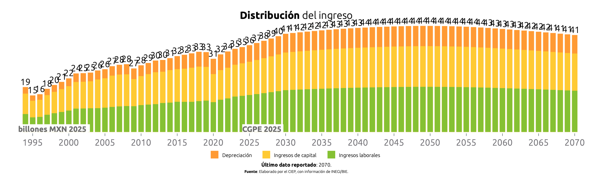
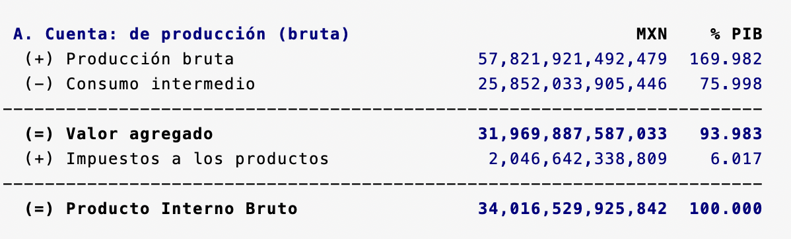
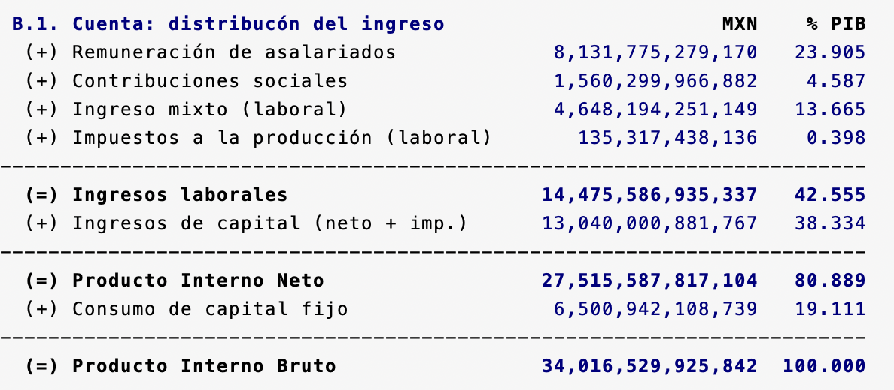
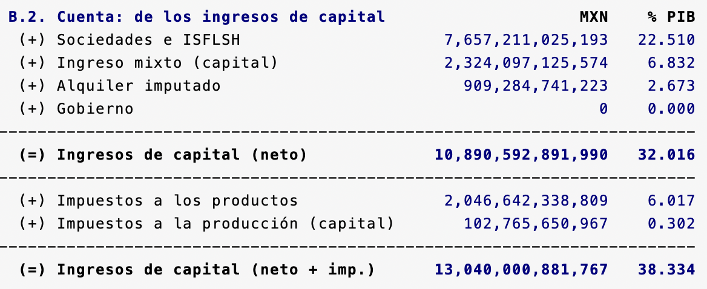
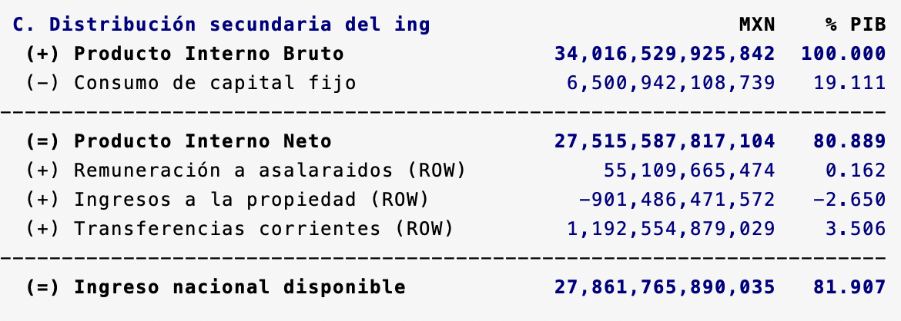
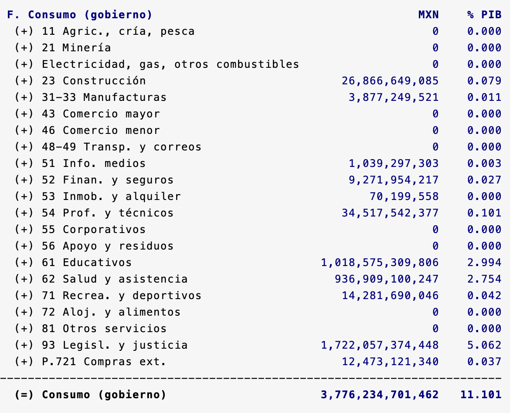

# Simulador Fiscal CIEP: Sistema de Cuentas Nacionales

Versión: 22 de marzo de 2025

## ARCHIVO: SCN.ado
**Descripción:** *Ado-file* que automatiza la extracción y proyección de datos del Sistema de Cuentas Nacionales (SCN) del INEGI.

 

**Alcance:** Para abordar las limitaciones en la disponibilidad de información, se implementó un modelo que realiza un *forecast* para proyectar datos futuros. Como resultado, el programa presenta una base de datos integral del SCN, con información abarcando desde 1993 hasta 2070. 

  
**Esta es la información que encontrarás aquí**

* **Cuenta de producción bruta:** Presenta el cálculo del PIB utilizando el método del valor agregado, considerando la producción total menos el consumo intermedio. 
* **Cuenta de distribución del ingreso:** Desglosa el PIB a través de los ingresos de asalariados, las ganancias de las empresas y el consumo de capital fijo.
* **Cuenta de los ingresos del capital:** Examina las ganancias de las empresas. 
* **Distribución secundaria del ingreso:** Contabiliza los ingresos disponibles para el país.
* **Utilización del ingreso disponible**  Calcula el ingreso nacional disponible utilizando el método del uso. Se obtiene sumando el consumo de los hogares, el gasto del gobierno, las importaciones netas y el ahorro bruto, lo que genera el PIB. Restando el consumo de capital fijo, se obtiene el Ingreso Nacional Disponible.
* **Consumo de los hogares:** Desglosa el gasto de los hogares en bienes y servicios.
* **Consumo Gobierno:** Detalla el consumo público en bienes y servicios.
*  **Cuenta de actividad económica:**  Calcula el PIB por el método del valor agregado, de cada sector productivo e incorporando los impuestos sobre los bienes y servicios. 

<h3 style="color: #ff7020;">1. Bases de datos (inputs):</h3>

En este programa se integran dos fuentes de datos:

1. Banco de Indicadores (BIE):  Proporciona datos sobre el ingreso, la producción bruta, la cuenta de ingreso nacional disponible, el consumo de los hogares, el gasto de consumo privado, el gasto de consumo del gobierno y el PIB por actividad económica. [^1] 

2. Cuentas por Sectores Institucionales (CSI): Proporciona información sobre el ingreso mixto bruto, las cuotas a la seguridad social, los subsidios a los productos, la producción e importaciones y los excedentes de operación.[^2]

<h3 style="color: #ff7020;">2. Sintaxis:</h3>

Para extraer los datos, es necesario ingresar el prompt en la consola siguiendo esta sintaxis:

`SCN [, ANIO(int) ANIOMax(int) NOGraphs UPDATE]`

Para crear comandos de manera automática y evitar errores de sintaxis, utiliza nuestra calculadora de prompts.

    <h4 style="border-bottom: 2px solid black; display: inline-block;">Calculadora de Prompts</h4>

**A. Opciones disponibles:**
<!-- Opciones para PIBDeflactor -->

  <label for="anio">Año Inicial (1993-2069):</label>
  <input 
    type="number" 
    id="anio" 
    placeholder="Ej. 2025" 
    oninput="actualizarComando()"
  >

  <label for="aniomax">Año Final (1994-2070):</label>
  <input type="number" id="aniomax" placeholder="Ej. 2070" oninput="actualizarComando()">

  <label for="noGraphs">Sin gráficos:</label>
  <input type="checkbox" id="noGraphs" onchange="actualizarComando()">

  <label for="update">Actualizar base:</label>
  <input type="checkbox" id="update" onchange="actualizarComando()">

<strong>Copia y pega este comando en la consola:</strong>

<pre id="códigoComando">SCN</pre>

  
**Descripción de opciones:**

  
 - **Año Inicial (anio):** Cambia el año de referencia. Tiene que ser un número entre 1993 y el año actual, que es el valor default. 

- **Año Máximo (aniomax)**: Define el año límite hasta el cual se extenderá la proyección en la gráfica.
- **Sin Gráfico (nographs)**: Evita la generación de gráficas.
- **Actualizar Base (update)**: Corre un *do.file* para obtener los datos más recientes del SHCP. 
  

<h3 style="color: #ff7020;">3. Base de datos (output):</h3>

Tras ingresar el prompt, el código devolverá tres elementos. La ventana de resultados, dos gráficas y una base de datos. A diferencia de otros programas, consideramos que la ventana de resultados es el principal elemento de interés.

**1. Ventana de Resultados:** Muestra un resumen del Sistema de Cuentas Nacionales. En total, encontrarás ocho tablas.

 

  
Calculo por método de valor agregado (Tabla A y G):

**A. Cuenta de producción bruta:**
La tabla muestra cómo se calcula el PIB desde el valor agregado. Se obtiene restando el consumo intermedio a la producción bruta y sumando los impuestos a los productos.

 

**G. Cuenta de actividad económica:**
La tabla desglosa el PIB por sector económico, mostrando la contribución de cada actividad al valor agregado bruto.

  

  
  

  
Calculo por método de los recursos (Tabla B1, B2, C):

**B1. Cuenta de Distribución del ingreso:**
La tabla muestra cómo se calcula el PIB desde la distribución del ingreso, desglosando la participación del trabajo y el capital. 

**B2. Cuenta de los ingresos del capital:**
La tabla muestra la composición de los ingresos de capital en la economía, incluyendo ganancias empresariales, ingreso mixto del capital (1/3 del ingreso mixto total) y alquileres imputados.

**C. Distribución secundaria del ingreso:**
La tabla muestra cómo se transforma el PIB en ingreso nacional disponible a través de la distribución secundaria del ingreso.

  
 

 

  
Cálculo por el método de los usos (Tabla D, E y F):

**D. Utilización del ingreso disponible:**
La tabla muestra cómo se distribuye el ingreso nacional disponible entre consumo, ahorro y otras transacciones

**E. Consumo de los hogares e ISFLSH:** La tabla muestra el consumo de hogares e ISFLSH en diferentes categorías de bienes y servicios.

<small>*Solo los elementos con (+) se consideran para la suma.</small>

**F. Consumo de gobierno**
La tabla muestra la distribución del gasto del gobierno por sectores económicos.

  
 
  
**2. Gráficas:** Representación visual del PIB.

PIB por el método de los recursos:
 

PIB por el método de los usos:
 

**3. Base de datos:**  Permite al usuario obtener una base recortada y limpia para hacer sus propios análisis.

[^1]: **Link:** [Banco de Indicadores](https://www.inegi.org.mx/app/indicadores/) 
[^2]: **Link:** [Cuentas de Sectores Institucionales](https://www.inegi.org.mx/temas/si/#tabulados)

---

<h3 style="color: #ff7020;">4. Información técnica:</h3>

**A. Variables principales generadas:**
- `PIB`: Producto Interno Bruto (nominal)
- `PIN`: Producto Interno Neto
- `RemSal`: Remuneración de asalariados (excluye seguridad social)
- `RemSalSS`: Remuneración total (incluye seguridad social)
- `MixL`: Ingreso mixto laboral (2/3 del ingreso mixto neto)
- `MixK`: Ingreso mixto de capital (1/3 + depreciación)
- `Yl`: Ingreso laboral total
- `CapIncImp`: Ingreso de capital neto con impuestos
- `CapFij`: Consumo de capital fijo (depreciación)
- `IngDisp`: Ingreso nacional disponible
- `ConsPriv`: Consumo privado total
- `ConsGob`: Consumo de gobierno
- `ROW`: Transferencias netas del resto del mundo

**B. Variables por sector económico:**
- `PIB_11`: Agricultura, ganadería y pesca
- `PIB_21_23`: Minería y electricidad
- `PIB_31_33`: Industrias manufactureras  
- `PIB_43_46`: Comercio
- `PIB_48_49`: Transportes
- `PIB_51_56`: Servicios empresariales
- `PIB_61_62`: Educación y salud
- `PIB_71_81`: Otros servicios
- Más sectores detallados hasta `PIB_93`

**C. Scalars generados (en millones MXN):**
- `ProdBruta`, `ProdBrutaPIB`: Producción bruta total y % del PIB
- `ConsInter`, `ConsInterPIB`: Consumo intermedio y % del PIB
- `ValoAgreg`, `ValoAgregPIB`: Valor agregado y % del PIB
- `RemSal`, `RemSalPIB`: Remuneraciones y % del PIB
- `SSocial`, `SSocialPIB`: Seguridad social y % del PIB
- `Yl`, `YlPIB`: Ingreso laboral y % del PIB
- `CapIncImp`, `CapIncImpPIB`: Ingreso de capital y % del PIB
- `PIB`, `PIPIB`: PIB total (siempre 100%)
- `crecpibpGEO`, `crecpibfGEO`: Tasas de crecimiento geométrico

**D. Archivos de salida:**
- `04_master/SCN.dta`: Base completa con todas las cuentas nacionales (1993-2070)
- Gráficos PNG en carpeta `users/$id/graphs/`:
  - `gdp_generacion.png`: PIB por método de distribución del ingreso
  - `gdp_utilizacion.png`: PIB por método de utilización (gasto)

**E. Dependencias:**
- `PIBDeflactor`: Obtiene deflactores y años base
- `UpdateSCN`: Subrutina que descarga datos del BIE/INEGI y CSI
- `scalarlatex` (opcional): Exporta scalars para LaTeX con opción `textbook`

**F. Fuentes de datos procesadas:**
1. **BIE/INEGI**: 200+ series del Banco de Indicadores sobre cuentas nacionales
2. **CSI**: Archivos Excel de Cuentas por Sectores Institucionales:
   - Ingreso mixto bruto
   - Cuotas de seguridad social imputada
   - Subsidios por tipo
   - Excedente de operación por sector
   - Transferencias del resto del mundo

**G. Metodología de proyección:**
- **Período histórico**: 1993-2023 (datos observados)
- **Período proyectado**: 2024-2070 (forecast basado en tasas de crecimiento del PIB)
- **Retropolación**: 1993-2002 utilizando patrones de crecimiento del PIB nominal
- **Consistencia**: Se garantiza que Yl + CapIncImp + CapFij = PIB (100%) 

