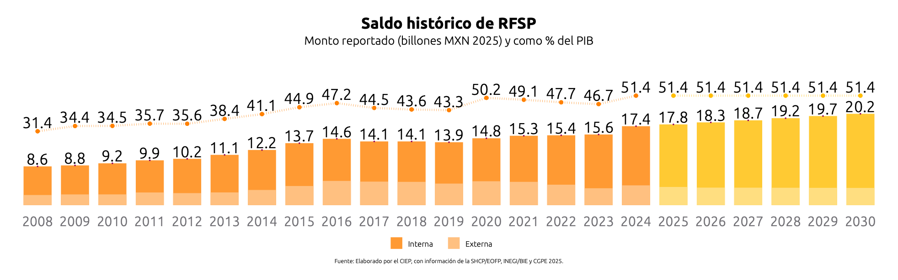
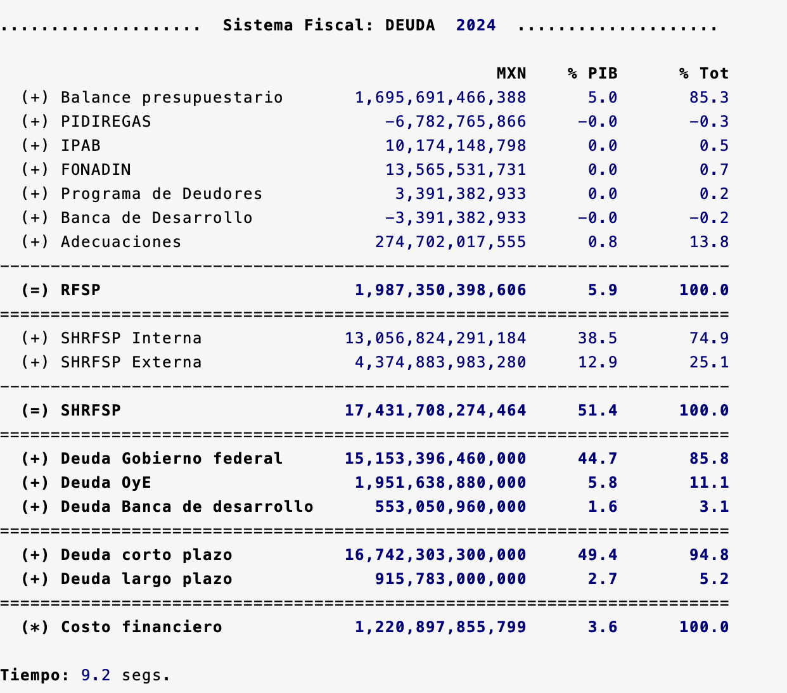
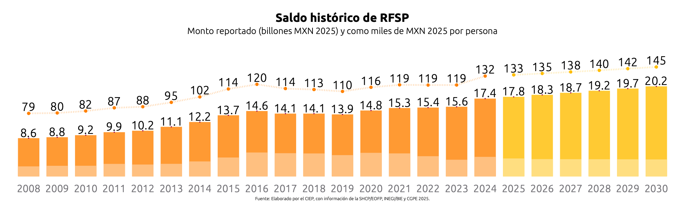
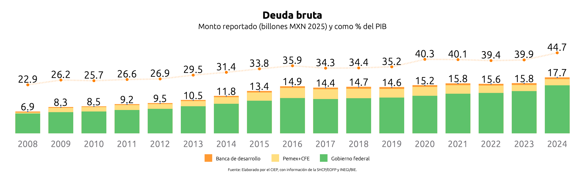
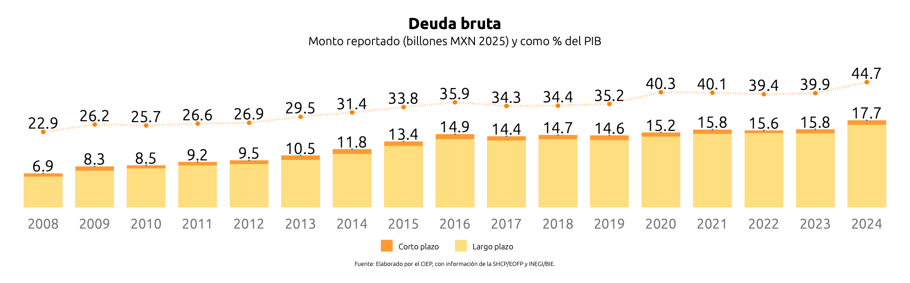
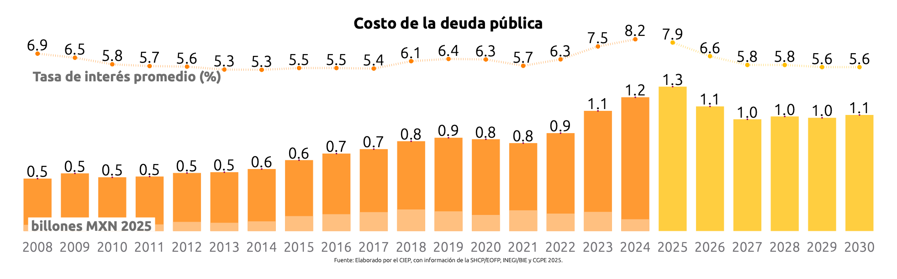
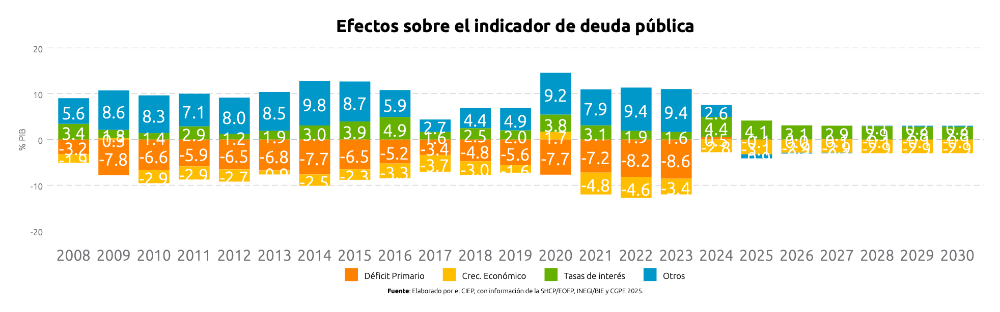
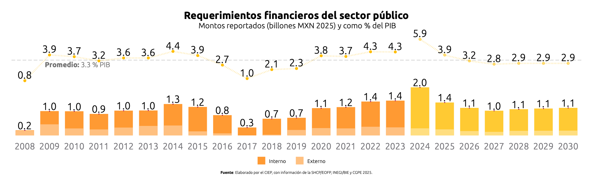
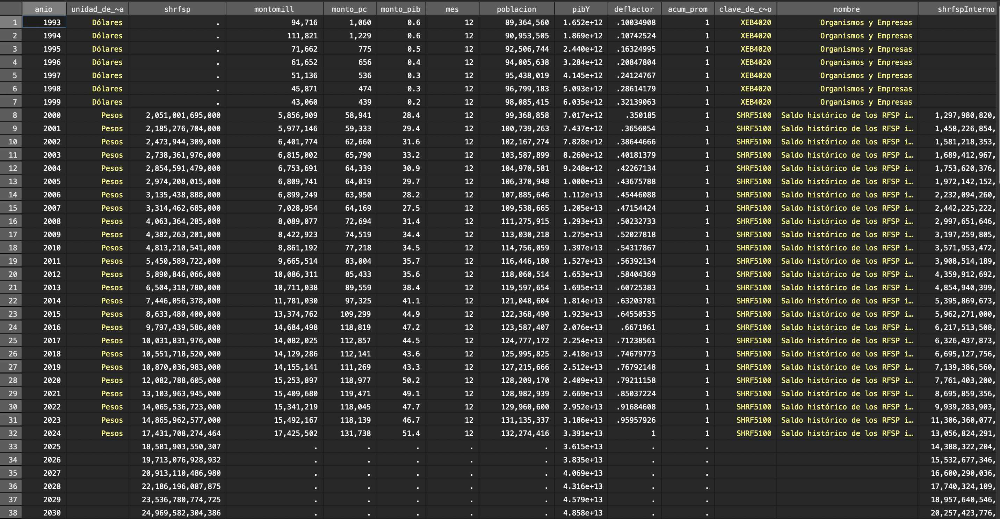

# Simulador Fiscal CIEP: Saldo Histórico de los Requerimientos Financieros del Sector Público (SHRFSP)

Versión: 4 de marzo de 2025

<hr style="border: none; height: 2px; background-color: #ff7020;">

## SHRFSP.ado

**Descripción:** *Ado-file* diseñado para automatizar la extracción y el análisis del Saldo Histórico de los Requerimientos Financieros del Sector Público (SHRFSP). Utiliza información proveniente de la Secretaría de Hacienda y Crédito Público (SHCP) y del INEGI para calcular indicadores relacionados con la deuda pública y la estructura fiscal. 



<details>
  <summary>**Esta es la información que encontrarás aquí:**</summary>
  ---
  **1. Indicadores anuales sobre deuda**
  
  - Balance presupuestario.
  - Balance de proyectos fuera del presupuesto: PIDIGERAS, IPAB, FONADIN, Programa de Deudores, Banca de Desarrollo y Adecuaciones.
 
 
</details>
  

<h3 style="color: #ff7020;">1. Input:</h3>

Este programa utiliza dos fuentes de datos:

1. Estadísticas Oportunas de la SHCP: Proporciona información sobre finanzas públicas del país, incluyendo balances fiscales, ingresos, gastos y deuda pública [^1]
2. BIE:  Proporciona datos sobre el PIB y el deflactor de precios. [^2]

<h3 style="color: #ff7020;">2. Sintaxis:</h3>

Para extraer los datos, es necesario ingresar el prompt en la consola siguiendo esta sintaxis:

`SHRFSP [, ANIO(int) ULTanio(int) NOGraphs UPDATE Base]`


Para crear comandos de manera automática y evitar errores de sintaxis, utiliza nuestra calculadora de prompts.


<div style="text-align: center;">
    <h4 style="border-bottom: 2px solid black; display: inline-block;">Calculadora de Prompts</h4>
</div>


<div>
  <label for="anioVp">Año:</label>
  <input 
    type="number" 
    id="anioVp" 
    placeholder="Ej. 2024" 
    oninput="actualizarComando()">
</div>
<div>
  <label for="ultAnio">Último Año:</label>
  <input type="number" id="ultAnio" placeholder="Ej. 2001" oninput="actualizarComando()">
</div>
<div>
  <label for="noGraphs">Sin gráficos:</label>
  <input type="checkbox" id="noGraphs" onchange="actualizarComando()">
</div>
<div>
  <label for="update">Actualizar:</label>
  <input type="checkbox" id="update" onchange="actualizarComando()">
</div>
<div>
  <label for="base">Solo desplegar base:</label>
  <input type="checkbox" id="base" onchange="actualizarComando()">
</div>


<p><strong>Copia y pega este comando en la consola:</strong></p>
<pre id="codigoComando">SHRFSP</pre>

<script>
  function actualizarComando() {
    // Obtiene los valores de cada campo
    var anioVp       = document.getElementById("anioVp").value;
    var noGraphs     = document.getElementById("noGraphs").checked;
    var update       = document.getElementById("update").checked;
    var base         = document.getElementById("base").checked;
    var ultAnio      = document.getElementById("ultAnio").value;
    
    // Comando base
    var comando = "SHRFSP";
    
    // Construye las opciones adicionales
    var opciones = "";
    if (anioVp)       { opciones += " anio(" + anioVp + ")"; }
    if (noGraphs)     { opciones += " nographs"; }
    if (update)       { opciones += " update"; }
    if (base)         { opciones += " base"; }
    if (ultAnio)      { opciones += " ultanio(" + ultAnio + ")"; }
    
    // Agrega las opciones al comando si existen
    if (opciones.trim() !== "") {
      comando += "," + opciones;
    }
    
    // Actualiza el contenido del <pre> con el comando final
    document.getElementById("codigoComando").textContent = comando;
  }
</script>

<details>
  <summary>**Descripción de opciones:**</summary>
  
 - **Año (anio):** Cambia el año de referencia. Tiene que ser un número entre 1993 y el año actual, que es el valor default.

- **Último año (ultanio)**: Especifica el último año de referencia para la gráfica. Debe ser anterior al año base y estar dentro del rango de 1993 hasta el año actual. El valor predeterminado es 2001.

- **Sin Gráfico (nographs)**: Evita la generación de gráficas.

- **Actualizar Base (update)**: Corre un *do.file* para obtener los datos más recientes del SHCP y el INEGI. 

- **Solo Base (base)**:  Permite descargar únicamente la base de datos sin aplicar cálculos adicionales.
  
</details>


<h3 style="color: #ff7020;">3. Output:</h3>

Tras ingresar el prompt, el código devolverá tres elementos. La ventana de resultados, siete gráficas y una base de datos. 

**1. Ventana de Resultados:** 

  
**2. Gráficas:** 

**Saldo histórico de RSFP (% de PIB):** Muestra el saldo de la deuda neta del sector público, desglosada en deuda externa e interna. Además, presenta la deuda como porcentaje del PIB.


**Saldo histórico de RSFP (Deuda per Cápita):** Muestra la deuda neta del sector público, desglosada en deuda externa e interna. Además, calcula la deuda per cápita.



**Deuda Bruta (Entidades Deudoras):** Muestra el acumulado de la deuda bruta del sector público, desglosada por las entidades deudoras.



**Deuda Bruta (Tipo de Deuda):** Muestra el acumulado de la deuda bruta del sector público, desglosada por tipo de deuda


**Costo de la Deuda:** Muestra el costo financiero de la deuda. También, detalla la tasa de interés promedio[^3] de la deuda. 


**Efectos sobre el indicador de deuda:** Presenta los factores económicos que contribuyen al aumento o reducción de la deuda, como indicador del PIB.



**Requerimientos financieros del sector público:** Muestra el nivel de endeudamiento del sector público para cada año. 


**3. Base de Datos:** Permite obtener una base de datos recortada y limpia para hacer sus propios análisis.


<details>
  <summary>**Información sobre la base de datos**</summary>
  
 1. Información sobre los valores: Todos los montos en la base de datos son en valor nominal, salvo que se indique lo contrario. La información de las cifras proviene directamente de fuentes públicas.
 2. En el caso de que selecciones la opción 
`solo base`, el programa te devolverá una base de datos sin ningún tipo de procesamiento. Se desplegará exactamente igual que en fuentes públicas. Consideramos que esta es una buena opción si quieres empezar tus análisis desde cero. 

</details>

## Sintaxis completa (documentación técnica)

```stata
SHRFSP [if] [, ANIO(int año_actual) DEPreciacion(int 5) NOGraphs UPDATE Base ULTAnio(int 2001) TEXTbook]
```

### Opciones técnicas no documentadas anteriormente:

- **DEPreciacion(int 5)**: Tasa de depreciación anual utilizada para ajustar la deuda externa por efectos cambiarios. Valor predeterminado: 5%

- **TEXTbook**: Modo especial para generar gráficos sin títulos ni fuentes (para uso en libros de texto)

## Dependencias

### Programas .ado requeridos:
- **`PIBDeflactor.ado`**: Para obtener PIB, deflactor, población y ajustes macroeconómicos
- **`UpdateSHRFSP.do`**: Para actualizar datos desde fuentes oficiales (SHCP)

### Archivos de datos requeridos:
- **`04_master/SHRFSP.dta`**: Base consolidada con saldos históricos de deuda pública
- **`01_raw/SHRFSP.dta`**: Datos crudos de Estadísticas Oportunas SHCP
- Acceso a internet para actualización desde fuentes oficiales

### Variables globales utilizadas:
- **`$pais`**: Nombre del país para títulos de gráficos
- **`$id`**: Identificador de usuario para rutas personalizadas
- **`$export`**: Ruta para exportar gráficos PNG (si está definida)
- **Parámetros exógenos**: Variables de política fiscal para años futuros

## Cálculos y metodología técnica

### 4.1 Población ajustada por productividad:
```stata
Poblacion_ajustada = Poblacion * lambda
```
Donde lambda incorpora cambios en productividad demográfica.

### 4.2 Indicadores per cápita:
```stata
indicador_PC = indicador / Poblacion_ajustada
```

### 4.3 Indicadores como porcentaje del PIB:
```stata
indicador_PIB = (indicador / pibY) * 100
```

### 4.4 Porcentaje del total de RFSP:
```stata
indicador_PorTot = (componente / rfsp_total) * 100
```

### 4.5 Ajuste por depreciación cambiaria:
```stata
// Ajuste de deuda externa por efectos de tipo de cambio
deuda_externa_ajustada = deuda_externa * (1 + depreciacion/100)
```

## Inputs (archivos de entrada)

### Estructura de `04_master/SHRFSP.dta`:
Variables principales:
- **Temporales**: `anio`, `mes`
- **SHRFSP (Saldo Histórico)**: `shrfsp`, `shrfsp_ext`, `shrfsp_int`
- **RFSP (Requerimientos)**: `rfsp`, `rfspBalance`, `rfspPIDIREGAS`, `rfspIPAB`, `rfspFONADIN`, `rfspDeudores`, `rfspBanca`, `rfspAdecuaciones`
- **Balance fiscal**: `balprimario`, `ingresos`, `egresos`
- **Costo financiero**: `costodirecto`, `costoindirecto`
- **Deuda por entidad**: Variables por sector y tipo de deuda
- **Tasas de interés**: `tasaEfectiva` por tipo de instrumento

### Componentes del SHRFSP:

#### Saldo Histórico (stock de deuda):
1. **SHRFSP Total**: Deuda neta del sector público
2. **SHRFSP Externa**: Deuda denominada en moneda extranjera
3. **SHRFSP Interna**: Deuda denominada en moneda nacional

#### Requerimientos Financieros (flujo anual):
1. **Balance presupuestario**: Déficit/superávit fiscal tradicional
2. **PIDIREGAS**: Proyectos de infraestructura diferidos en gasto
3. **IPAB**: Instituto para la Protección al Ahorro Bancario
4. **FONADIN**: Fondo Nacional de Infraestructura
5. **Programa de Deudores**: Apoyos a deudores
6. **Banca de Desarrollo**: Programas de banca de desarrollo
7. **Adecuaciones**: Otros ajustes y adecuaciones

## Outputs (archivos y variables generadas)

### Archivos exportados:

#### Gráficos (.gph y .png):
1. **`shrfsp`**: Saldo histórico de RFSP como % del PIB
2. **`shrfsppc`**: Deuda per cápita (histórico)
3. **`shrfsplif`**: SHRFSP vs recaudación fiscal
4. **`shrfspIntExt`**: Deuda bruta por entidades deudoras
5. **`shrfspResumen`**: Deuda bruta por tipo de deuda
6. **`tasasdeinteres`**: Costo de la deuda y tasas de interés
7. **`rfsp`**: Requerimientos financieros del sector público
8. **`rfspBalOtros`**: RFSP balance presupuestario vs otros
9. **`efectoDeuda`**: Efectos sobre el indicador de deuda

#### Ubicación de archivos:
- **Stata graphs**: `05_graphs/{nombre}.gph`
- **PNG exports**: `$export/{nombre}.png` (si $export está definida)

### Variables en dataset final:
- **Saldos básicos**: `shrfsp`, `shrfsp_ext`, `shrfsp_int`
- **Como % PIB**: `shrfsp_pib`, `shrfsp_ext_pib`, `shrfsp_int_pib`
- **Per cápita**: `shrfsp_pc`, `shrfsp_ext_pc`, `shrfsp_int_pc` 
- **RFSP componentes**: `rfspBalance`, `rfspPIDIREGAS`, `rfspIPAB`, `rfspFONADIN`, `rfspDeudores`, `rfspBanca`, `rfspAdecuaciones`
- **Fiscal**: `balprimario`, `ingresos`, `egresos`
- **Costos**: `costodirecto`, `costoindirecto`, `tasaEfectiva`
- **Población**: `Poblacion`, `Poblacion_ajustada`
- **Macroeconómicas**: `pibY`, `pibYR`, `deflator`, `lambda`

### Scalars de retorno principales:

#### Por cada componente de RFSP, se generan 4 scalars:
- **`{componente}Monto`**: Valor absoluto en millones de moneda local
- **`{componente}PIB`**: Como porcentaje del PIB
- **`{componente}PorTot`**: Como porcentaje del RFSP total
- **`{componente}PC`**: Per cápita en moneda local

#### Componentes específicos:
1. **Balance presupuestario**:
   - `rfspBalanceMonto`, `rfspBalancePIB`, `rfspBalancePorTot`, `rfspBalancePC`

2. **PIDIREGAS**:
   - `rfspPIDIREGASMonto`, `rfspPIDIREGASPIB`, `rfspPIDIREGASPorTot`, `rfspPIDIREGASPC`

3. **IPAB**:
   - `rfspIPABMonto`, `rfspIPABPIB`, `rfspIPABPorTot`, `rfspIPABPC`

4. **FONADIN**:
   - `rfspFONADINMonto`, `rfspFONADINPIB`, `rfspFONADINPorTot`, `rfspFONADINPC`

5. **Programa de Deudores**:
   - `rfspDeudoresMonto`, `rfspDeudoresPIB`, `rfspDeudoresPorTot`, `rfspDeudoresPC`

6. **Banca de Desarrollo**:
   - `rfspBancaMonto`, `rfspBancaPIB`, `rfspBancaPorTot`, `rfspBancaPC`

7. **Adecuaciones**:
   - `rfspAdecuacionesMonto`, `rfspAdecuacionesPIB`, `rfspAdecuacionesPorTot`, `rfspAdecuacionesPC`

#### Totales y agregados:
- **`shrfspMonto`**, **`shrfspPIB`**, **`shrfspPC`**: Saldo histórico total
- **`shrfsp_extMonto`**, **`shrfsp_extPIB`**, **`shrfsp_extPC`**: Deuda externa
- **`shrfsp_intMonto`**, **`shrfsp_intPIB`**, **`shrfsp_intPC`**: Deuda interna
- **`rfspMonto`**, **`rfspPIB`**, **`rfspPC`**: Requerimientos financieros totales

#### Indicadores de costo:
- **`tasaEfectiva`**: Tasa de interés efectiva promedio
- **`costodirectoMonto`**, **`costodirectoPIB`**: Costo directo de la deuda
- **`costoindirectoMonto`**, **`costoindirectoPIB`**: Costo indirecto

## Ejemplos prácticos actualizados

### Ejemplo 1: Análisis básico de deuda pública
```stata
SHRFSP, anio(2024)
```

### Ejemplo 2: Análisis histórico desde año específico
```stata
SHRFSP, anio(2024) ultanio(2010)
```

### Ejemplo 3: Actualizar datos y generar sin gráficos
```stata
SHRFSP, anio(2024) update nographs
```

### Ejemplo 4: Análisis con tasa de depreciación personalizada
```stata
SHRFSP, anio(2024) depreciacion(8)
```

### Ejemplo 5: Obtener base de datos cruda
```stata
SHRFSP, base
// Datos sin procesamiento, directamente de fuentes oficiales
```

### Ejemplo 6: Modo textbook (gráficos sin títulos)
```stata
SHRFSP, anio(2024) textbook
```

### Ejemplo 7: Análisis para período específico
```stata
SHRFSP if anio >= 2015 & anio <= 2024, nographs
```

## Interpretación de resultados

### Indicadores clave:

#### SHRFSP como % del PIB:
- **< 30%**: Nivel de deuda bajo (sostenible)
- **30-60%**: Nivel de deuda moderado (requiere atención)
- **> 60%**: Nivel de deuda alto (puede requerir ajustes fiscales)

#### RFSP vs Balance presupuestario:
- **RFSP > Balance**: Hay pasivos fuera del presupuesto (PIDIREGAS, IPAB, etc.)
- **RFSP = Balance**: Solo hay déficit presupuestario tradicional
- **RFSP < Balance**: Hay ingresos extraordinarios o prepagos

#### Composición interna vs externa:
- **Alta deuda externa**: Mayor vulnerabilidad a choques cambiarios
- **Alta deuda interna**: Mayor competencia con sector privado por financiamiento

### Alertas de sostenibilidad:
- Tasa de crecimiento de SHRFSP > tasa de crecimiento del PIB
- Costo de la deuda > tasa de crecimiento económico
- Concentración excesiva en deuda de corto plazo
- Dependencia excesiva de financiamiento externo

## Ver también

### Programas relacionados:
- **`PIBDeflactor`**: Proporciona series macroeconómicas para cálculos
- **`UpdateSHRFSP`**: Actualiza datos desde Estadísticas Oportunas SHCP
- **`FiscalGap`**: Utiliza SHRFSP para análisis de sostenibilidad fiscal
- **`LIF`/`PEF`**: Analizan ingresos y gastos que determinan el balance
- **`TasasEfectivas`**: Calcula tasas efectivas por tipo de instrumento de deuda

### Fuentes de datos:
- **SHCP - Estadísticas Oportunas**: Datos mensuales de finanzas públicas
- **INEGI - BIE**: Series macroeconómicas (PIB, población, deflactor)
- **Banxico**: Tipos de cambio y tasas de interés (complementario)

## Notas técnicas actualizadas

### Definiciones conceptuales:

#### SHRFSP vs RFSP:
- **SHRFSP** (Saldo): Stock de deuda acumulada (posición al final del período)
- **RFSP** (Requerimientos): Flujo anual de endeudamiento neto (cambios en el período)

#### Metodología de cálculo:
```
SHRFSP(t) = SHRFSP(t-1) + RFSP(t) + Ajustes_cambiarios(t)
```

### Tratamiento de datos faltantes:
- Series incompletas se proyectan usando tendencias históricas
- Datos mensuales se anualizan para consistencia
- Missing values se interpolan cuando es técnicamente válido

### Ajustes metodológicos:
- **Población ajustada**: Incorpora efectos de productividad (lambda)
- **Depreciación**: Ajusta deuda externa por efectos cambiarios esperados
- **Deflactor**: Convierte series nominales a términos reales cuando se requiere

### Limitaciones:
- Datos históricos disponibles desde 1993
- Algunas series tienen rezagos de publicación (2-3 meses)
- Cambios metodológicos de SHCP pueden afectar comparabilidad histórica
- Proyecciones dependen de supuestos sobre política fiscal y variables macroeconómicas

### Rendimiento:
- **Tiempo de ejecución**:
  - Sin actualización: 8-15 segundos
  - Con actualización: 30-120 segundos  
  - Con 9 gráficos: +20-30 segundos adicionales
- **Dataset típico**: 300-800 observaciones
- **Memoria**: 10-25 MB según nivel de detalle
- **Compatibilidad**: Stata 14+

[^1]: **Link:** [Estadísticas Oportunas](http://presto.hacienda.gob.mx/EstoporLayout/estadisticas.jsp) 

[^2]: **Link:** [Banco de Indicadores](https://www.inegi.org.mx/app/indicadores/) 

[^3]: La tasa de interés se obtiene mediante la división del monto de los intereses pagados entre la deuda para el mismo año.