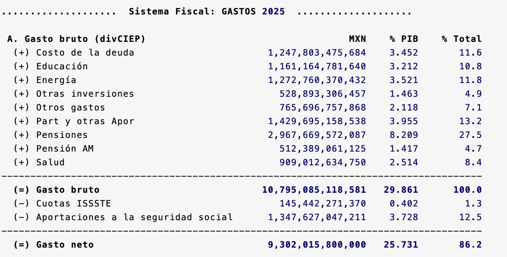
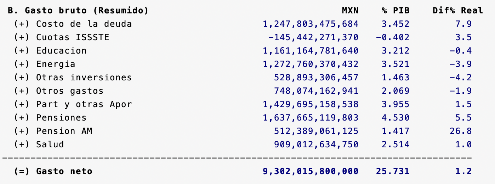
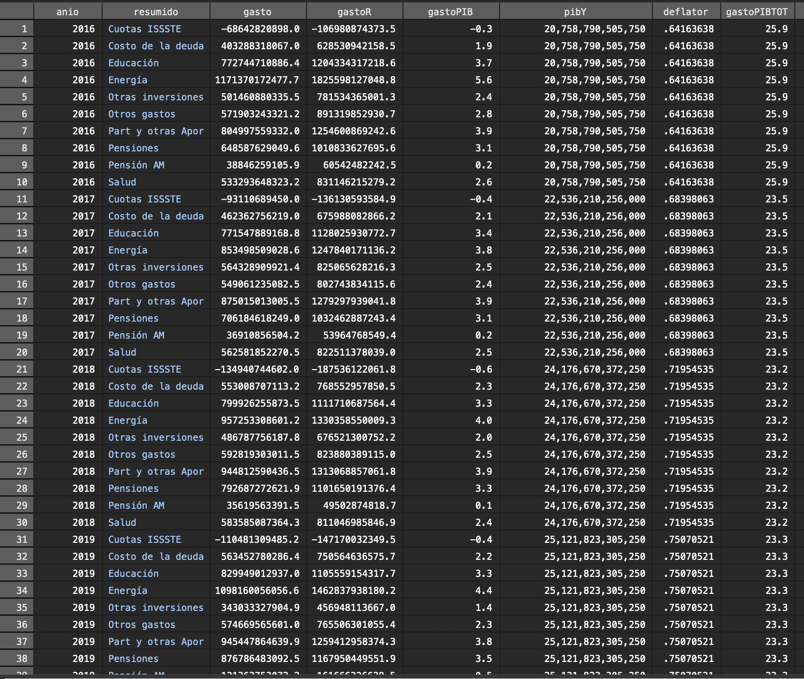

# Simulador Fiscal CIEP: Presupuesto de Egresos de la Federación (PEF)
Versión: 6 de marzo de 2025

## PEF.ado
**Descripción:** *Ado-file* diseñado para automatizar la extracción y el análisis de datos del Presupuesto de Egresos de la Federación (PEF). Este programa permite extraer y analizar analizar automáticamente los datos oficiales del gasto público publicados por la SHCP. También se utilizan datos del INEGI para cálculos adicionales.

**Alcance:** Permite consultar el gasto histórico desde 2013 hasta el año actual. Se desglosa la distribución del gasto en salud, educación, seguridad y otros sectores. Además, podrás evaluar su relación con el PIB.

<h3 style="color: #ff7020;">1. Input:</h3>

En este programa se utilizan tres fuentes de datos: 

1. Cuenta Pública: Contiene la distribución de los recursos públicos ejercidos en el gasto del gobierno federal.
2. Presupuesto de Egresos de la Federación: Es el documento que detalla la distribución de los recursos públicos aprobada para el gasto del gobierno federal. Estos datos se utilizan cuando la cuenta pública todavía no ha sido públicada.
3. BIE: Proporciona datos sobre el PIB, el deflactor de precios, la inflación y el empleo. [^2] 

<h3 style="color: #ff7020;">2. Sintaxis:</h3>

    <h4 style="border-bottom: 2px solid black; display: inline-block;">Calculadora de Prompts</h4>

<!-- A. Opciones disponibles -->
<!-- Opción 1: Año Base -->

  <label for="anioVp">Año Base:</label>
  <input 
    type="number" 
    id="anioVp" 
    placeholder="Ej. 2024" 
    oninput="actualizarComando()">

<!-- Opción 2: Año de comparación -->

  <label for="desde">Año de comparación:</label>
  <input 
    type="number" 
    id="desde" 
    placeholder="Ej. 2013" 
    oninput="actualizarComando()">

<!-- Se ha eliminado la opción de manejo de datos faltantes -->

<!-- Opción 3: Sin gráficos -->

  <label for="noGraphs">Sin gráficos:</label>
  <input type="checkbox" id="noGraphs" onchange="actualizarComando()">

<!-- Opción 4: Actualizar base -->

  <label for="update">Actualizar base:</label>
  <input type="checkbox" id="update" onchange="actualizarComando()">

<!-- Opción 5: Solo base -->

  <label for="base">Solo base:</label>
  <input type="checkbox" id="base" onchange="actualizarComando()">

  
**Descripción de opciones**:

  
  * Año Base (anio): Cambia el año de referencia. 
  * Año de comparación (desde): Especifica el año con el que se compararán los datos.
  * Sin Gráficos (nographs): Evita la generación de gráficas.
  * Actualizar Base (update): Corre un do-file para obtener los datos más recientes.
  * Solo Base (base): Permite descargar únicamente la base de datos sin aplicar cálculos adicionales.

  

<!-- Personalización de gráfica -->

    <h4 style="border-bottom: 2px solid black; display: inline-block;">Personalización de gráfica</h4>

<!-- Opción 6: Rango mínimo -->

  <label for="minimum">Rango mínimo:</label>
  <input type="number" id="minimum" step="0.1" placeholder="Ej. 0.5" oninput="actualizarComando()">

<!-- Opción 7: Filas -->

  <label for="rows">Filas:</label>
  <input type="number" id="rows" placeholder="Ej. 1" oninput="actualizarComando()">

<!-- Opción 8: Columnas -->

  <label for="cols">Columnas:</label>
  <input type="number" id="cols" placeholder="Ej. 5" oninput="actualizarComando()">

<!-- Opción 9: Título -->

  <label for="title">Título:</label>
  <input type="text" id="title" placeholder="Ej. Ingresos Fiscales" oninput="actualizarComando()">

  
**Descripción de opciones de Personalización de gráfica**:

 
   * Rango mínimo (minimum): Define el porcentaje mínimo del PIB que un concepto de gasto debe alcanzar para ser visualizado en la gráfica. A mayor valor, mayor cantidad de conceptos caen dentro del rubro "otros".
   * Filas (rows): Número de filas en la leyenda de la gráfica.
   * Columnas (cols): Número de columnas en la leyenda de la gráfica.
   * Título (title): Título de la gráfica.
   

<strong>Copia y pega este comando en la consola:</strong>

<pre id="códigoComando">PEF</pre>

<h3 style="color: #ff7020;">3. Output:</h3>

Tras ingresar el prompt, el código devolverá tres elementos. La ventana de resultados, tres gráficas y una base de datos. 

**1. Ventana de Resultados:** Muestra 3 tablas con información de los egresos de la federación.

Tabla A Gasto Bruto: Presenta el Gasto Bruto en volumen total, porcentaje del PIB y participación relativa dentro del gasto total.

Tabla B Gasto Neto (resumido): Presenta el gasto neto en volumen total, porcentaje del PIB y el crecimiento real desde la fecha de comparación.

Tabla C Cambios: Muestra las diferencias de los gastos en porcentaje del PIB entre los dos periodos seleccionados.

**2. Gráficas:** Muestra la composición del gasto público por año.

**3. Base de Datos:** Permite obtener una base de datos recortada y limpia para hacer sus propios análisis. 

  
**Información sobre la base de datos**

  
 1. Información sobre los valores: Todos los montos en la base de datos son en valor nominal, salvo que se indique lo contrario. La información de las cifras proviene directamente de fuentes públicas.
 2. En el caso de que selecciones la opción 
`solo base`, el programa te devolvera una base de datos sin ningún tipo de procesamiento. Se desplegará exactamente igual que en fuentes públicas. Consideramos que esta es una buena opción si quieres empezar tus análisis desde cero. 

[^]: **Link:** [Sitio Web Transparencia](https://www.transparenciapresupuestaria.gob.mx/Datos-Abiertos) 

[^2]: **Link:** [Presupuesto de Egresos](https://www.ppef.hacienda.gob.mx/) 

[^3]: **Link:** [Banco de Indicadores](https://www.inegi.org.mx/app/indicadores/) 

