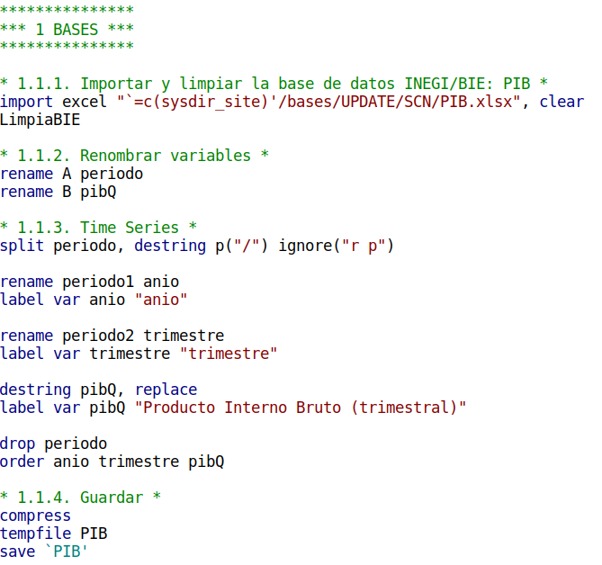
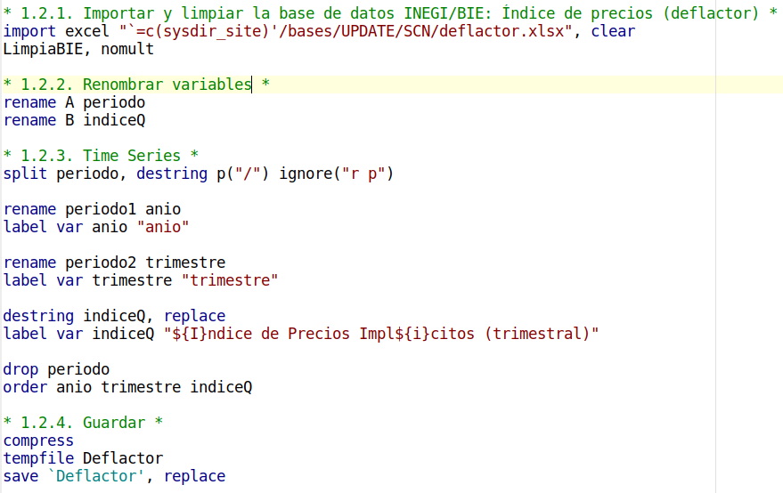
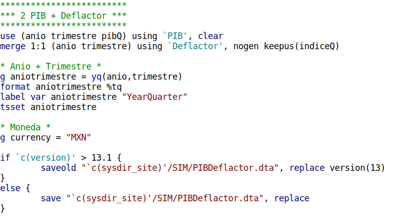

# PIB y su deflactor
    Versión: 14 de julio de 2022. Autor: Ricardo

---

## UpdatePIBDeflactor.do
Este *do-file* **actualiza** la base de datos del simulador, `c(sysdir_site)/SIM/PIBDeflactor.dta`, con la información presente en los archivos:

- `c(sysdir_site)/bases/UPDATE/SCN/PIB.xlsx`
- `c(sysdir_site)/bases/UPDATE/SCN/deflactor.xlsx`

Para actualizar los valores del **PIB trimestral** (`PIB.xlsx`) y del **Índice precios implícitos trimestral** (`deflactor.xlsx`), ir a:

[Cómo actualizar el SCN](Actualizar el SCN.md)

### 1. Base de datos INEGI/BIE: PIB
**Importar** y **limpiar** la base de datos del PIB, publicada por el Banco de Información Económica (BIE) del INEGI.

### 2. Base de datos INEGI/BIE: Deflactor de precios
**Importar** y **limpiar** la base de datos del PIB, publicada por el Banco de Información Económica (BIE) del INEGI.

### 3. Unión de datos y guardar base `c(sysdir_site)/SIM/PIBDeflactor.dta`
**Unir** las bases de datos limpias del *PIB* y el *Deflactor*. Adicionalmente, se **genera** la variable `aniotrimestre`, el cual será utilizado para definir la serie de tiempo.

### 4. Finalización
Al finalizar, **aparecerá una gráfica** con la información alimentada. Este paso significa que el *do-file* corrió sin errores. **¡Felicidades!**

FIN de `UpdatePIBDeflactor.do`

---

## PIBDeflactor.ado

### 1. Actualizar la base de datos
El *do-file* `UpdatePIBDeflactor.do` puede ejecutarse desde el comando (*ado-file*) `PIBDeflactor`, con la siguiente sintaxis desde la consola de `Stata`:

`PIBDeflactor, update`

Este paso se tiene que realizar **solamente una vez**, hasta la próxima actualización (próximo trimestre).

### 2. Sintaxis

`PIBDeflactor` [*if*] [*ANIOvp(int) GEOPIB(int) GEODEF(int) NOGraphs NOOutput DIScount(real) UPDATE SAVE*]

**Opciones**

- **aniovp**: cambia el año de referencia para el *valor presente*. Tiene que ser un íntegro (i.e. no número fraccionado) entre 1993 (mínimo reportado por el INEGI/BIE) y 2050 (máximo proyectado por el CONAPO, en su base de población).
- **geopib**: 
- **geodef**:
- **fin**: 
- **nographs**:
- **nooutput**:
- **discount**:
- **update**:
- **save**:

### 3. Bases de datos

### 4. Variables en términos reales

### 5. Imputar parámetros

### 6. Proyecciones

### 7. Gráficas y textos

### 8. Finalización

FIN de `PIBDeflactor.ado`
