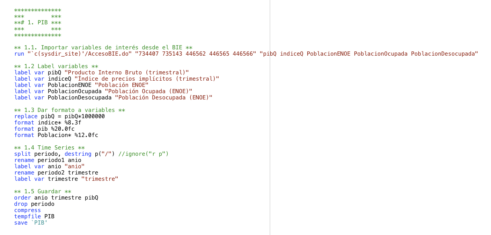
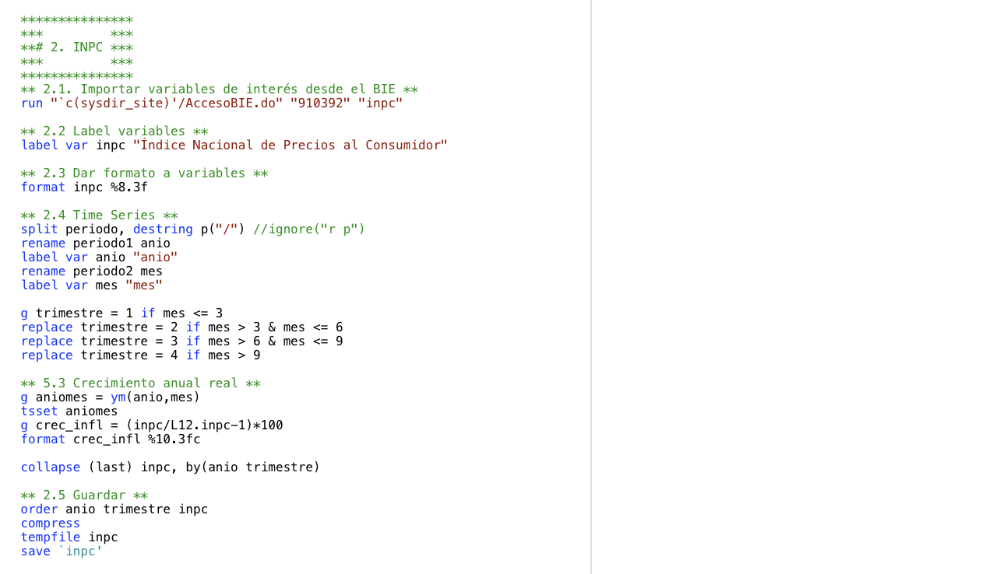
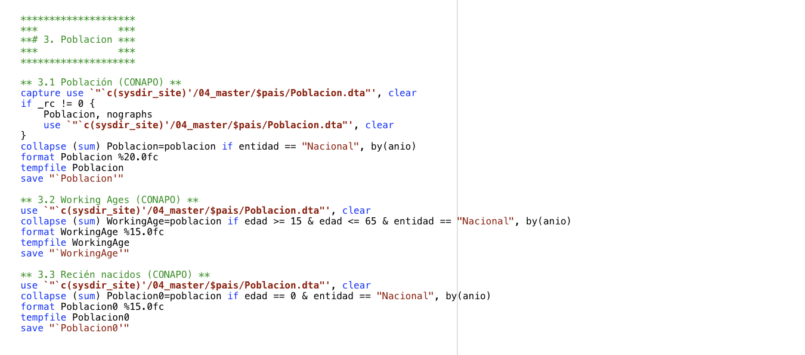
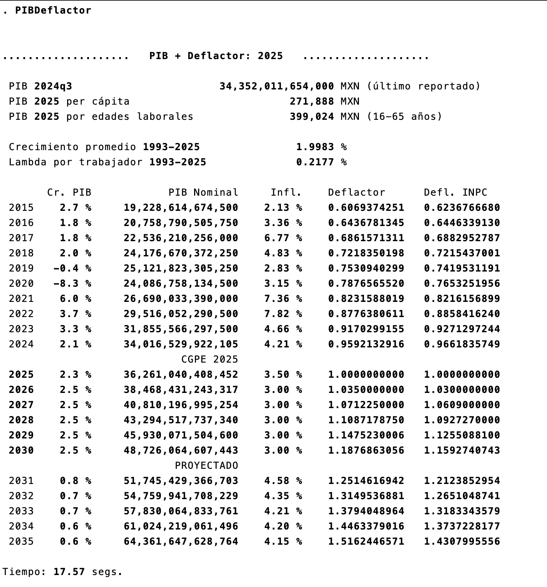
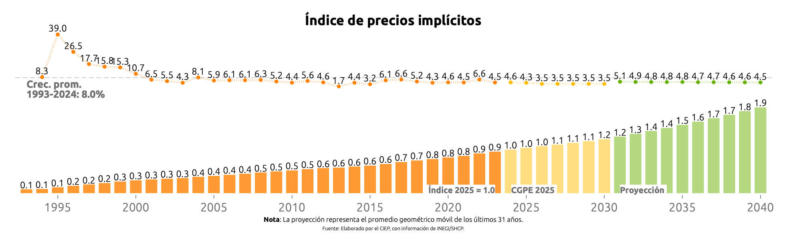
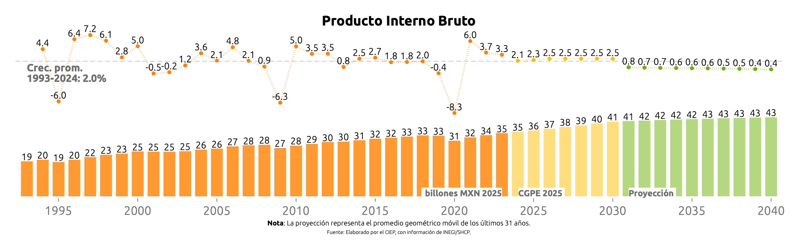
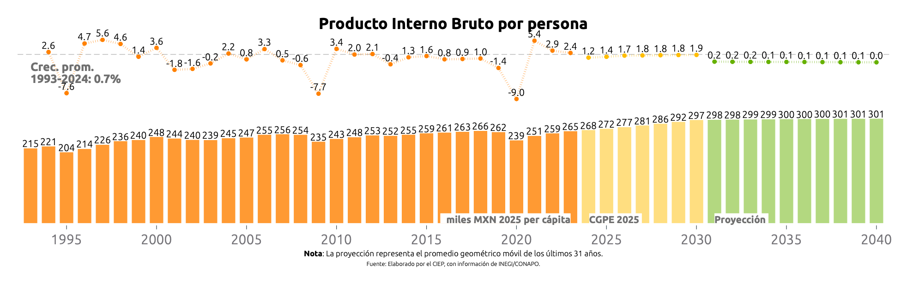
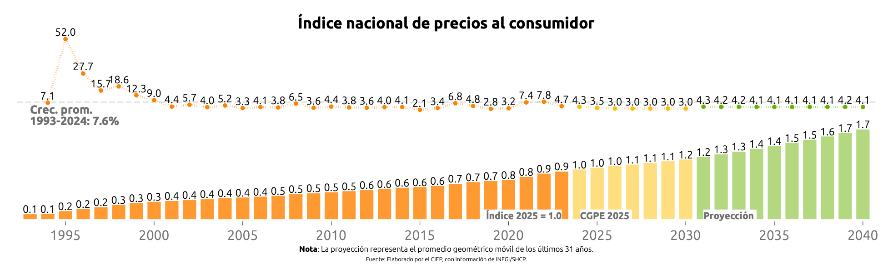
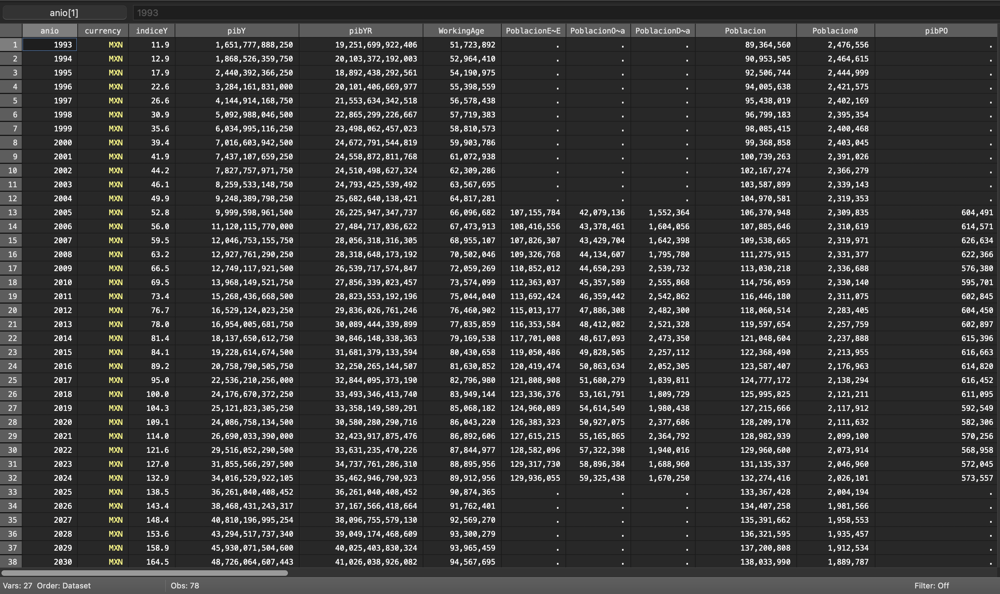

# Simulador Fiscal CIEP: PIB, deflactor y proyecciones

Versión: 20 de Febrero de 2025

## PIBDeflactor.ado
**Descripción**: *Ado-file* diseñado para automatizar el acceso y generar proyecciones de indicadores económicos clave a partir de escenarios definidos por el usuario. Desarrollado con información del Banco de Información Económica (BIE) y el Consejo Nacional de Población (CONAPO).

  
**Conoce la lista de indicadores generados**

---
**1. Crecimiento Económico y Productividad**  

* **pibY:** PIB nominal en moneda corriente.
* **pibYR:** PIB real ajustado por inflación.
* **var_pibY:** Crecimiento anual del PIB real.
* **var_pibG:** Promedio geométrico del crecimiento del PIB real.
* **PIBPob:** PIB real per cápita.
* **pibPO:** PIB real por población ocupada.
* **OutputPerWorker:** PIB real por población en edad de trabajar.
* **pibYVP:** PIB real descontado a valor presente.

**2. Demografía**  

* **PoblacionENOE:** Población total estimada según la ENOE de INEGI.
* **PoblacionOcupada:** Población ocupada según la ENOE de INEGI.
* **PoblacionDesocupada:** Población desocupada según la ENOE de INEGI.
* **Poblacion:** Estimaciones de población de CONAPO.
* **PoblacionO:** Población ocupada ajustada para cálculos de productividad.
* **WorkingAge:** Población en edad de trabajar (15-65 años) según CONAPO.

**3. Precios e Inflación**  

* **inpc:** Índice Nacional de Precios al Consumidor (INPC).
* **IndiceY:** Índice de precios implícitos del PIB.
* **deflator:** Deflactor del PIB con base en el índice de precios implícitos.
* **deflatorpp:** Poder adquisitivo ajustado por inflación.
* **var_indiceY:** Crecimiento anual del índice de precios implícitos.
* **var_indiceG:** Promedio geométrico del crecimiento del índice de precios.
* **var_inflY:** Inflación anual calculada con el INPC.
* **var_inflG:** Promedio geométrico de la inflación en varios años.

---

 

<h3 style="color: #ff7020;">1. Input:</h3>

En este programa se utilizan dos fuentes de datos:

1. BIE:  Proporciona datos sobre el PIB, el deflactor de precios, la inflación y el empleo. [^1] 

2. CONAPO: Contiene la estimación del número de habitantes a mitad de cada año entre 1950 y 2070. [^2]

  
Mostrar código fuente

  BIE:
  
  
  CONAPO:
  

<h3 style="color: #ff7020;">2. Sintaxis:</h3>

Recuerda que este programa tiene dos funciones: acceder a los datos económicos y generar proyecciones económicos a partir de escenarios definidos por el usario. Antes de generar las proyecciones, es necesario ejecutar el programa para cargar los datos económicos.

<h5 style="color: #ff7020;">Accede a los datos:</h3>

Para extraer los datos, es necesario ingresar el comando en la consola siguiendo esta sintaxis:

`PIBDeflactor [if] [, ANIOvp(int) ANIOMAX(int 2070)  GEOPIB(int) GEODEF(int) DIScount(real) NOGraphs UPDATE]`

Para crear comandos de manera automática y evitar errores de sintaxis, utiliza nuestra calculadora de prompts.

    <h4 style="border-bottom: 2px solid black; display: inline-block;">Calculadora de Prompts</h4>

**Opciones disponibles:**
<!-- Opciones para PIBDeflactor -->

  <label for="anioVp">Año Base:</label>
  <input 
    type="number" 
    id="anioVp" 
    placeholder="Ej. 2024" 
    oninput="actualizarComando()"
  >

  <label for="aniofinal">Año Final:</label>
  <input type="number" id="aniomax" placeholder="Ej. 2070" oninput="actualizarComando()">

  <label for="geopib">Promedio Geométrico (PIB):</label>
  <input type="number" id="geopib" placeholder="Ej. 1993" oninput="actualizarComando()">

  <label for="geodef">Promedio Geométrico (Deflactor):</label>
  <input type="number" id="geodef" placeholder="Ej. 1993" oninput="actualizarComando()">

  <label for="discount">Tasa de descuento:</label>
  <input type="number" id="discount" step="0.1" placeholder="Ej. 5" oninput="actualizarComando()">

  <label for="noGraphs">Sin gráficos:</label>
  <input type="checkbox" id="noGraphs" onchange="actualizarComando()">

  <label for="update">Actualizar base:</label>
  <input type="checkbox" id="update" onchange="actualizarComando()">

<strong>Copia y pega este comando en la consola:</strong>

<pre id="códigoComando">PIBDeflactor</pre>

  
**Descripción de opciones**

  
- **Año Base (aniovp)**: Cambia el año de referencia para calcular el *valor presente*. Tiene que ser un número entre 1993 (mínimo reportado por el INEGI/BIE) y 2050 (máximo proyectado por el CONAPO, en su base de población). El *año actual* es el valor por default.
- **Año Final (aniomax)**: Año final para las proyecciónes de las gráficas. El último año de la serie (2070) es el valor por default.
- **Promedio Geométrico PIB (geopib)**:  Año base a partir del cual se calcula el crecimiento geométrico promedio del PIB, utilizado para proyectar el crecimiento en años futuros. [^3]
- **Promedio Geométrico Deflactor (geodef)**:  Año base a partir del cual se calcula el crecimiento geométrico promedio del deflactor del PIB, utilizado para estimar la evolución de los precios en el futuro. [^4] 
- **Tasa de Descuento (discount)**: Tasa utilizada para convertir valores futuros del PIB en su equivalente a valor presente.
- **Sin Gráfico (nographs)**: Evita la generación de gráficas.
- **Actualizar Base (update)**: Corre un *do.file* para obtener los datos más recientes del BIE y el CONAPO. 

<h5 style="color: #ff7020;">Genera escenarios económicos:</h3>

Para generar escenarios económicos podras modificar 3 variables y observar los efectos en las proyecciones económicas.

1. Crecimiento económico:
2. 

<h3 style="color: #ff7020;">3. Output:</h3>

Tras ingresar el prompt, el código devolverá tres elementos: ventana de resultados, cuatro gráficas y la base de datos. Podrás modificar el ado.file para obtener una base a tus necesidades.

**1. Ventana de Resultados:** Muestra un resumen del análisis realizado. 

 

**2. Gráficas:** Representación visual de los indicadores calculados. 

Los indicadores se dividen en 3 temporalidades:

* Datos históricos (naranja): datos reales reportados desde 1993 hasta la fecha.
* Estimaciones de los CGPE (amarillo): datos estimados por la Secretaría de Hacienda desde la fecha actual hasta siete años en el futuro.
* Proyecciones CIEP (verde): datos proyectados utilizando la metodología del CIEP con base en tendencias históricas. 

#####A

#####B

#####C

#####D

**3. Base de Datos:** Permite al usuario obtener una base de datos recortada y limpia para hacer sus propios análisis.

   

[^1]: **Link:** [Banco de Indicadores](https://www.inegi.org.mx/app/indicadores/) 

[^2]: **Link:** [Bases de Datos CONAPO](https://www.gob.mx/conapo/articulos/reconstruccion-y-proyecciones-de-la-poblacion-de-los-municipios-de-mexico) 

[^3]: El promedio geométrico se calcula desde el año seleccionado hasta el año actual. Este valor se usa para estimar el PIB del siguiente año, aplicando el crecimiento promedio geométrico obtenido. A medida que avanzan los años, la ventana del cálculo se ajusta, incorporando el año más reciente y descartando el más antiguo.

[^4]: El cálculo se realiza desde el año seleccionado hasta el año actual para obtener una tasa de cambio promedio en los precios. Esta tasa se aplica para proyectar la inflación futura y ajustar el deflactor del PIB en los próximos años. La ventana de cálculo se ajusta dinámicamente año tras año, incorporando el dato más reciente y eliminando el más antiguo.