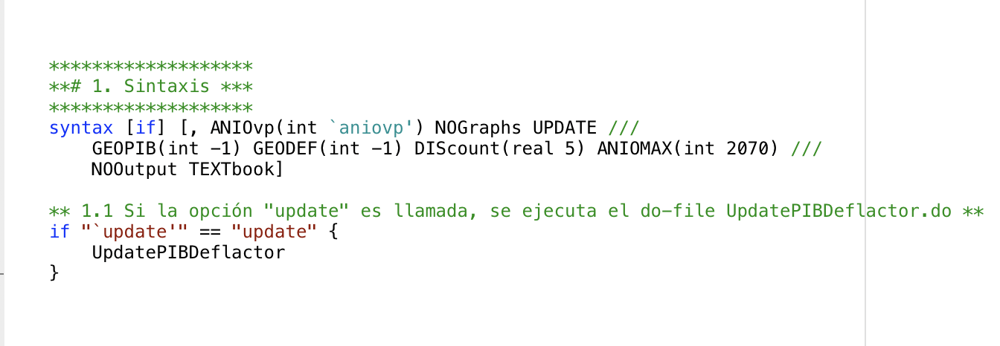

# Simulador Fiscal CIEP v5.3: PIB, deflactor y proyecciones

Versión: 28 de septiembre de 2022

---

## 1. UpdatePIBDeflactor.do
Es un *do-file* (`.do`) para que se tenga la libertad de modificarlo, en caso de ser necesario, por cambios en las nuevas bases. Sin embargo, se debe respetar la *estructura/formato de salida* para no generar conflictos posteriores en el Simulador. 

### Objetivo
1. **Actualizar** la base de datos [`c(sysdir_site)/SIM/PIBDeflactor.dta`] con la información presente en los archivos[^1]:
    - `c(sysdir_site)/bases/UPDATE/SCN/PIB.xlsx`
    - `c(sysdir_site)/bases/UPDATE/SCN/deflactor.xlsx`

[^1]: Para **actualizar** los valores de los archivos anteriores con los más recientes publicados por el INEGI, dentro de la carpeta `c(sysdir_site)/bases/UPDATE/SCN/`:
    1. **Dar doble click** a los archivos PIB.IQY y deflactor.IQY. El Excel empezará automáticamente a descargar la información del INEGI (posiblemente te pida habilitar el uso de "macros"). **Se requiere forzosamente de Excel para Windows.**
    2. **Guardar** y **reemplazar**, con el nuevo archivo descargado, el archivo con terminación .xlsx (Excel) que está bajo el _mismo nombre_ que su .IQY.

### 1. Base de datos INEGI/BIE: PIB
**Importar** y **limpiar** la base de datos del *Producto Interno Bruto* (PIB), publicada por el Banco de Información Económica (BIE) del INEGI[^2].

[^2]: El comando `LimpiaBIE` sirve para limpiar las bases del BIE y hacerlas más amigables para su manipulación.

### 2. Base de datos INEGI/BIE: Deflactor de precios
**Importar** y **limpiar** la base de datos del *Índice de precios implícitos* (deflactor), publicada por el BIE del INEGI.

### 3. Unión de datos y guardar base final
**Unir** las bases de datos limpias del *PIB* y el *Deflactor*. Adicionalmente, se **genera** la variable `aniotrimestre`, el cual será utilizado para definir la serie de tiempo. El archivo final, en formato `Stata 13`, se guarda en `c(sysdir_site)/SIM/PIBDeflactor.dta`.

### 4. Finalización
Al finalizar, **aparecerá una gráfica** con la información alimentada. Este paso significa que el *do-file* corrió sin errores. **¡Felicidades!**

---

## 2. PIBDeflactor.ado
Es un *ado-file* (`.ado`) para automatizar el procesamiento de resultados. Antes de iniciar, el comando verifica la existencia de la base `PIBDeflactor.dta`. Si no existe, se ejecuta el do-file `UpdatePIBDeflactor.do`. También revisa la existencia del scalar `aniovp`.

### 1. Sintaxis
`PIBDeflactor` [if] [, ANIOvp(int) ANIOFINal(int) NOGraphs UPDATE GEOPIB(int) GEODEF(int) DIScount(real) NOOutput]

- **aniovp**: cambia el año de referencia para calcular el *valor presente*. Tiene que ser un número entero (i.e. no fraccionado) entre 1993 (mínimo reportado por el INEGI/BIE) y 2050 (máximo proyectado por el CONAPO, en su base de población). El *año actual* es el valor por default.
- **aniofinal**: año final para las proyecciones. El último año de la serie es el valor por default.
- **nographs**: evita la generación de las gráficas (para mayor rapidez).
- **update**: ejecuta el *do-file* `UpdatePIBDeflactor.do`.
- **geopib**:
- **geodef**:
- **nooutput**: evita el despliegue de los outputs (para el simulador web).

### 2. Base de datos y display inicial
**Primero**, abre la base de datos `Poblacion.dta` y genera las variables llamadas `Poblacion` y  `WorkingAge` (edades entre 16 y 65 años). **Segundo**, abre la base de datos `PIBDeflactor.dta` y despliega el último *PIB Trimestral* disponible y su crecimiento con respecto al mismo trimestre del año anterior. **Tercero**, anualiza el PIB trimestral y une las bases de población previamente generadas.

### 3. Deflactor
Se construyen las variables `indiceY` (índice de precios implícitos anual), `var_indiceY` (variación anual del índice de precios implícitos) y `var_indiceG` (variación promedio geométrico anual del índice de precios implícitos). Además, para todos los años, si existe una estimiación sobre el crecimiento del deflactor (definidas por globales `$def{año}`), se imputa en la base de datos. Finalmente, se construye la variable `deflator` (en inglés), utilizando la observación del `aniovp' como el año base.

### 4. PIB
Se construyen las variables `pibYR` (PIB real anual), `var_pibY` (variación anual del PIB) y `var_pibG` (variación promedio geométrico anual del PIB). Además, para todos los años, si existe una estimiación sobre el crecimiento del PIB (definidas por globales `$pib{año}`), se imputa en la base de datos. Finalmente, se construye la variable `OutputPerWorker`, la cual muestra el PIB en términos de las personas en edades de trabajar. El scalar `lambda` muestra el crecimiento en la productividad por persona en edad de trabajar.

### 5. Proyecciones
Se realizan las proyecciones hacia el futuro, utilizando la información provista anteriormente.

### 6. Gráficas y textos
Al finalizar, se despliega la información calculada los parámetros provistos, así como las siguientes gráficas.

