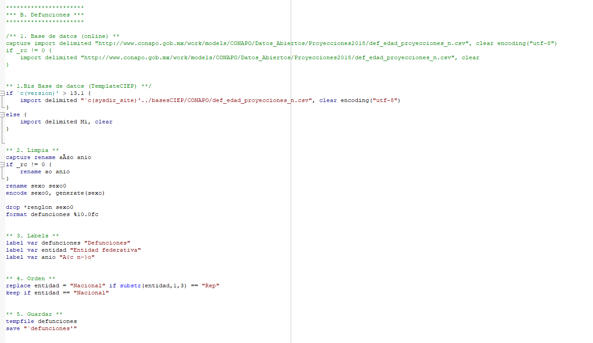
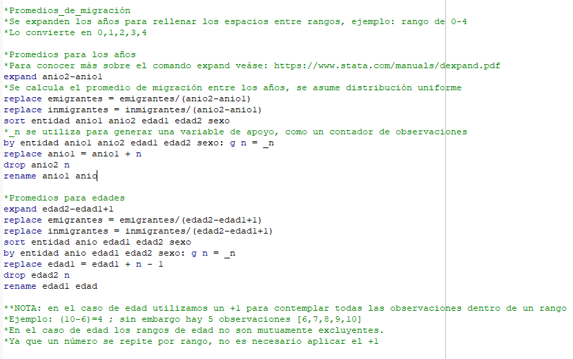
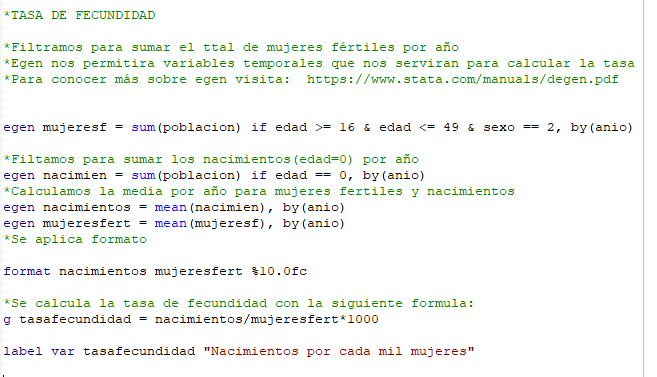

# Población y sus proyecciones

## UpdatePoblacion.do
El objetivo de `UpdatePoblacion.do` es **descargar las bases de datos** de CONAPO desde su página web y se convierten a formato Stata para los propósito del Simulador. Es un *do file* para que se tenga la libertad de modificarlo, en caso de ser necesarias modificaciones por estructuras/formatos de nuevas bases de datos. Sin embargo, se deber respetar la estructura/formato de salida.

En este caso, estructuramos las bases para conocer la composición demográfica por: *año, sexo, edad, entidad, población, defunciones, emigrantes, inmigrantes, mujeres en edad fértil y tasa de fecundidad*.

### Población
Primero, importamos las bases de datos que utilizaremos en el modulo de población disponible en:

“../basesCIEP/CONAPO/ censo2020.dta” [^2]

Esta base nos dará a conocer los valores de la población separada por año, sexo y edad.  

Se realiza la limpieza de variables y los problemas derivados de los caracteres especiales. En este caso se corrigen las variables Año y sexo. Además, le ponemos label en STATA a las variables Población, Entidad Federativa y Año.
La variable población se convierte a string separada por comas y sin decimales, para facilitar su interpretación. 

Posteriormente se ordena y guardamos de manera temporal la base de datos, ya que procederemos a trabajar con otra base. 

### B. Defunciones

Primero, cargamos la base de datos para esta sección. En este caso el programa contempla las versiones posteriores de STATA 13.1 para realizar una codificación, caso contrario la carga de manera normal. 
En este caso la base de datos se encuentra disponible en la siguiente dirección: 

"`c(sysdir_site)'../basesCIEP/CONAPO/def_edad_proyecciones_n.csv" [^3]

Posteriormente se limpian las variables sexo, año y defunciones. Las primeras dos nos servirán para unir esta base con la base población, mientras que defunciones es una variable nueva y escrita en formato separada por comas sin decimales. 

El archivo se guarda de manera temporal para utilizarla posteriormente. 

### C. Migración internacional
Para cargar la base se debe usar la dirección: 

"`c(sysdir_site)'../basesCIEP/CONAPO/” 

Misma donde se encontra la base de población y también utilizando  la ubicación de nuestro directorio “c(sysdir_site)”.

Al igual que población y defunciones se debe cambiar el nombre de las variables para arreglar los caracteres especiales. En este caso las variables son Año, sexo inmigrantes y emigrantes.
Esta base de datos tiene valores entre rangos de edad y años; por lo que se debe ajustar al formato de las otras dos bases del módulo. Utilizando STATA se crean promedios para asignar valores uniformes entre los rangos de edad y año[^4].

Posteriormente de agregan las labels necesarias para emigrantes, inmigrantes, entidad y año. Guardamos la base con el nombre de migración y ya es posible **unir nuestras bases.**

### D.Unión

Recordemos que la última base utilizada fue *migración*, por lo que es la base de datos que el programa está usando actualmente, considerada como la base de datos en la memoria. Usando los comandos **“use” y “merge”** vamos a unir estás tablas por medio de las variables **“año” ,”edad”, “sexo” y “entidad”**. También limpiamos los valores nulos “.” , reemplazándolos por ceros.

Para calcular la **tasa de fecundidad** se filtra la base de datos de tal manera que tengamos el total de mujeres en edades fértiles y nacimientos por año.  Posteriormente se calculan las medias por año y con la siguiente formulas obtenemos la tasa de fecundidad por año (nacimientos cada 1000 mujeres en edades fértiles). 

[^2]: Recordemos que el directorio fue definido en el inicio del código, los “..” al inicio de la dirección es para regresar un directorio de donde nos encontrábamos antes. Regresamos de la dirección “/TemplatesCIEP/simuladorCIEP” a la dirección “/Templates” para después ingresar a “../basesCIEP/CONAPO/”. 
[^3]: Recordando que `c(sysdir_site)' contiene la dirección del directorio base.  
[^4]: Se debe asumir una distribución uniforme de las variable de migración tanto en edad como en año. 

[Github]:https://github.com/
[simuladorCIEP]:https://github.com/rcantuc/simuladorCIEP

## Poblacion.ado
asdf
