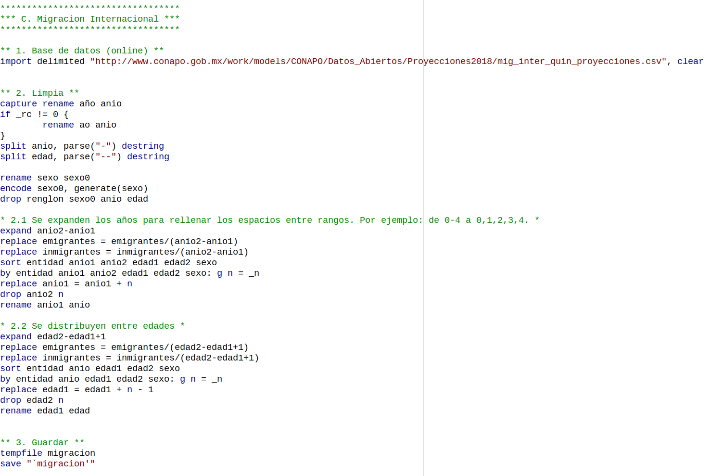
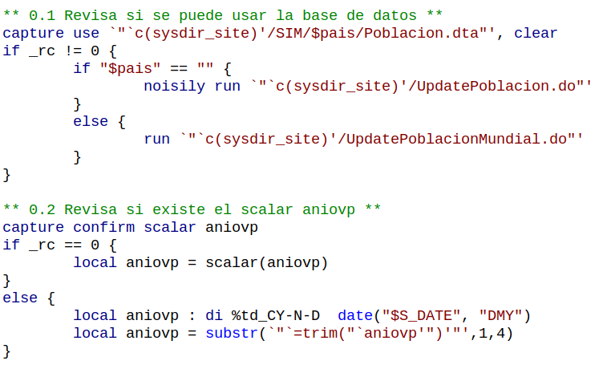
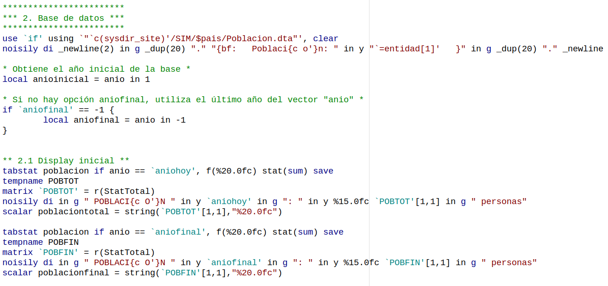

# Simulador Fiscal CIEP v5.3: Población y proyecciones

Versión: 28 de septiembre de 2022

---

## 1. UpdatePoblacion.do
Es un *do-file* (`.do`) para que se tenga la libertad de modificarlo, en caso de ser necesario, por cambios en las nuevas bases. Sin embargo, se debe respetar la *estructura/formato de salida*[^1] para no generar conflictos posteriores en el Simulador. Son de interés las siguientes variables:

* población,
* defunciones,
* emigrantes,
* inmigrantes y
* tasa de fecundidad.

[^1]: Se deben estructurar las bases, de tal forma, que podamos conocer la composición demográfica por **año, sexo, edad y entidad federativa**.

### Objetivos

1. **Descargar** las bases de datos de CONAPO desde su página web.
2. **Limpiar y convertir** las bases en formato Stata para los propósitos del Simulador.

### A. Población
1. **Importamos** las bases de datos.
2. **Limpiamos** las variables.
3. **Guardamos** (de manera temporal) la base de datos.

### B. Defunciones

1. **Importamos** las bases de datos.
2. **Limpiamos** las variables.
3. **Guardamos** (de manera temporal) la base de datos.

### C. Migración internacional
1. **Importamos** las bases de datos.
2. **Limpiamos** las variables. Esta base contiene los valores en rangos de edad; por lo tanto, se deben ajustar al formato de las otras dos bases del módulo. Se distribuyen los valores de manera uniforme entre los rangos de edad y año[^2].
3. **Guardamos** (de manera temporal) la base de datos.

[^2]: Se asume una distribución uniforme de las variable de migración, tanto en edad como en año. 

### D. Unión
1. Usando los comandos `use` y `merge`, **unimos las bases (temporales)** por medio de las variables año, edad, sexo y entidad.
2. **Limpiamos** los valores nulos (“.”) reemplazándolos por ceros y **renombramos** "República Mexicana" por "Nacional"
3. **Agregamos**  los labels a las variables.
4. **Calculamos la tasa de fecundidad** filtrando la base para tener el total de mujeres en edades fértiles y de los nacimientos por año (edad 0). Posteriormente, se calculan las medias por año y la tasa de fecundidad por año (nacimientos cada 1000 mujeres en edades fértiles).
5. Finalmente, **guardamos la base final** en "c(sysdir_site)/SIM/Poblacion.dta" y en  "c(sysdir_site)/SIM/Poblaciontot.dta"[^3]

[^3]: Por la diversidad de versiones disponibles de Stata, se guardan las bases en versión 13.

---

## 2. Poblacion.ado
Es un *ado-file* (`.ado`) para automatizar el procesamiento de resultados. Antes de iniciar, el comando verifica la existencia de la base `Poblacion.dta`. Si no existe, se ejecuta el do-file `UpdatePoblacion.do`. También revisa la existencia del scalar `aniovp`.

### 1. Sintaxis
`Poblacion [if] [, ANIOhoy(int) ANIOFINal(int) NOGraphs UPDATE]`

* **aniohoy**: año base para los resultados. El *año actual* es el valor por default.
* **aniofinal**: año final para las proyecciones. El último año de la serie es el valor por default.
* **nographs**: evita la generación de las gráficas (para mayor rapidez).
* **update**: ejecuta el do-file `UpdatePoblacion.do`.

### 2. Base de datos y display inicial
Abre la base de datos `Poblacion.dta` y despliega la población del año inicial y del año final.

### 3. Resultados
1. **Grafica de la pirámide demográfica** por edades y para el año inicial y final.
2. **Grafica de la transición demográfica** por grupo de edades y años.

