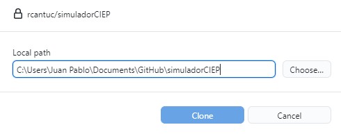

# Simulador Fiscal CIEP v5.3.x

	Versión: 12 julio 2022. Último programador: Ricardo

**¡Bienvenidxs al equipo!**

El **Simulador Fiscal CIEP** está actualmente programado en `Stata` (versiones 13+). Sin embargo, se espera incorporar otros programas, como `R`, para hacerlo más flexible. Es una herramienta que pretende ser eventualmente comunitaria y participativa para que sea utilizada para fines didácticos y analíticos.

---

## 0. Empezar a colaborar

1. **Instalar** el programa `Github Desktop` desde [Github.com](https://desktop.github.com/).
2. **Clonar** el repositorio del Simulador Fiscal CIEP.

    1. **Buscar** el repositorio [SimuladorCIEP](https://github.com/rcantuc/simuladorCIEP) dentro de la aplicación de escritorio de Github.

        

    2. **Guardar** una copia local (*branch*) en el equipo del usuario. **Recordar la dirección**. Esos archivos son los que se modificarán localmente antes de incorporar sus cambios en el *master* (globalmente).

        

3. **Abrir** el archivo `simulador.stpr`. El *Stata project* concentra todos los *do-files* y *ado-files* para su fácil acceso.

    

4. **Abrir** el archivo `SIM.do`. Es el *do-file* que arranca, genera, controla y modifica los parámetros de cada **simulación**[^1].

    

5. **Definir** el directorio `SITE` (donde se programará) dentro de `SIM.do`. Agregar el número de computadoras alternativas o secundarias desde donde se programará. Recordar que la dirección debe ser la misma donde se clonó el repositorio.

    

---
## 1. Opciones globales de `SIM.do`

### Comandos para limpiar el ambiente 

Los primeros tres comandos **borra**, en su totalidad, el ambiente de trabajo (scalares, globales, bases de datos, labels, etc.). 

1. `clear all` Elimina cualquier **variable/base de datos/label** guardada/abierta. 
2. `macro drop _all` Borrar todos los `scalar` y `global` previamente definidos. 
3. `capture log close _all` Cierran todos los *posibles* (capture) *log files* que puedan estar ejecutándose o que no se hayan cerrado correctamente.  
	

### Otras opciones

1. `update` : cuando se quiere *actualizar* TODAS las bases de datos (`DatosAbiertos`, `LIF`, `PEF`, `SHRFSP`, etc.)
2. `nographs` : cuando se quiere evitar que aparezcan las gráficas (recomendado para mayor velocidad de procesamiento)
3. `export` : cuando se quiere exportar las gráficas a un directorio en específico.
4. `output` : (únicamente utilizado para la versión WEB)
5. `pais` : cuando se tiene información para otros países
6. `PARAM.do` : *do file* donde se guardan TODOS los parámetros fiscales y económicos a **simular**

[^1]: Se define como cada DO o RUN que ejecutamos en el Stata para calcular los resultados de un escenario económico particular (el default/oficial o el de un usuario).
