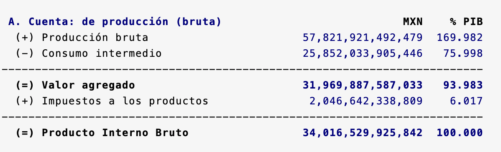
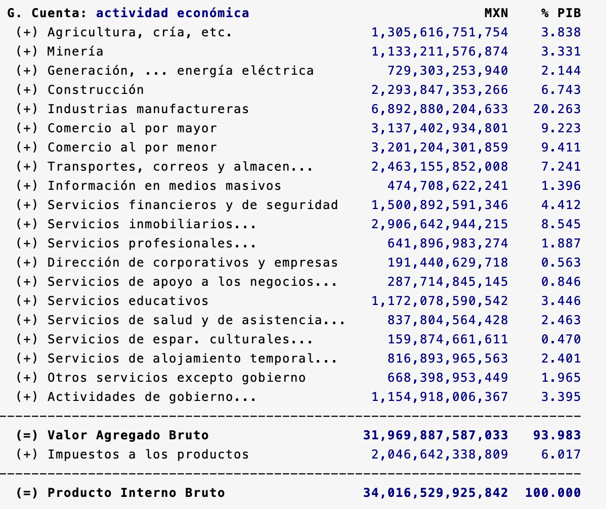
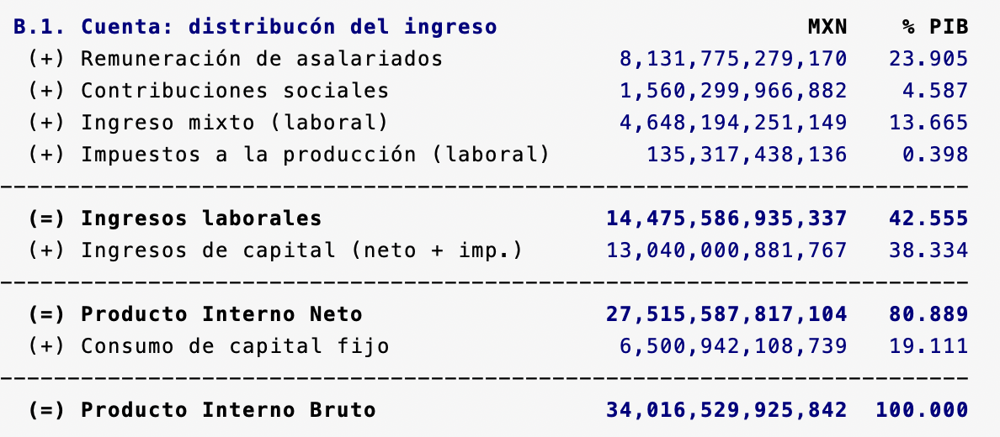
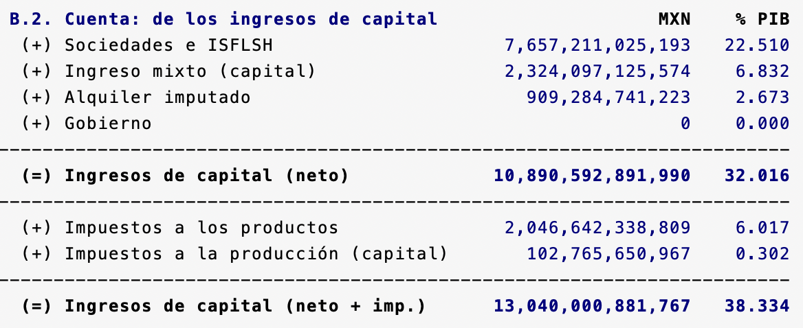
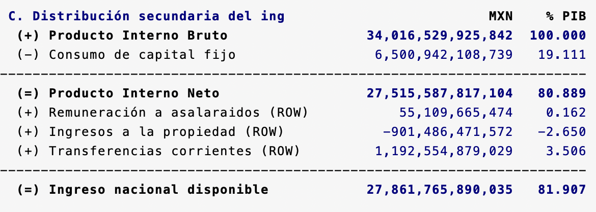
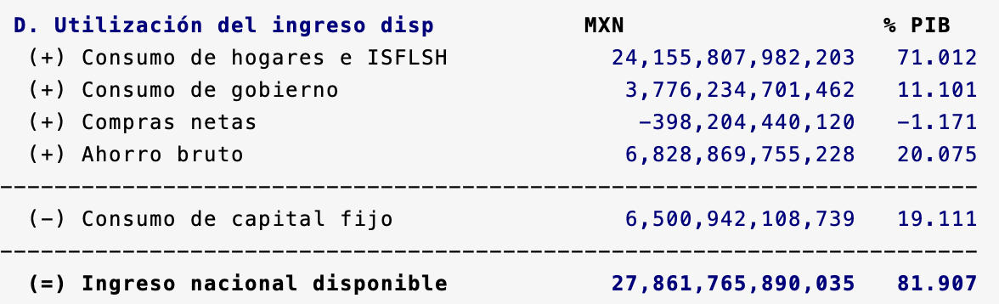
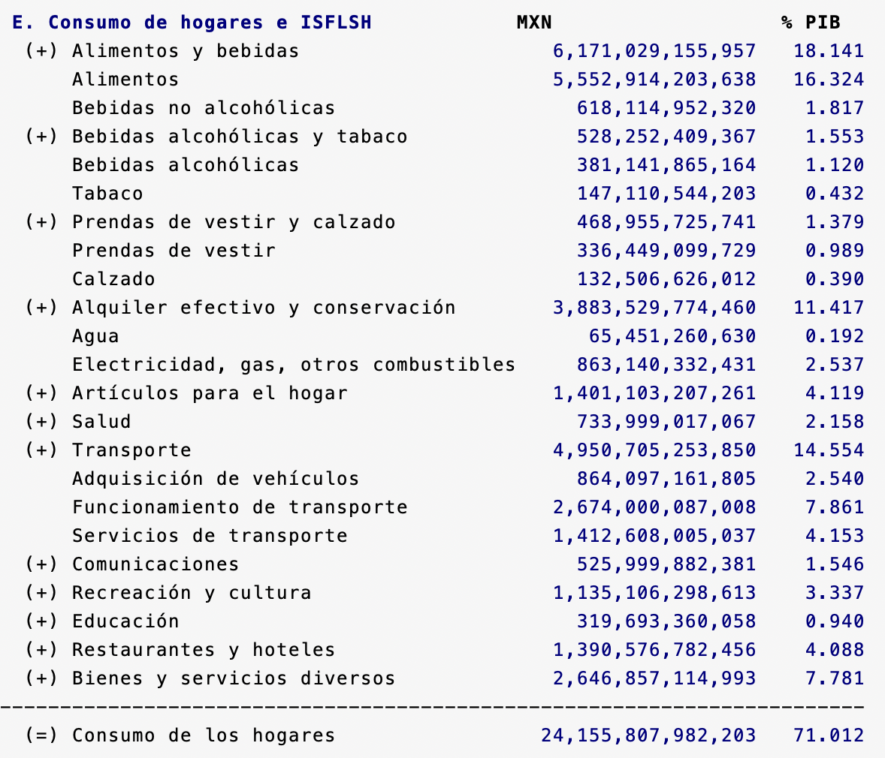
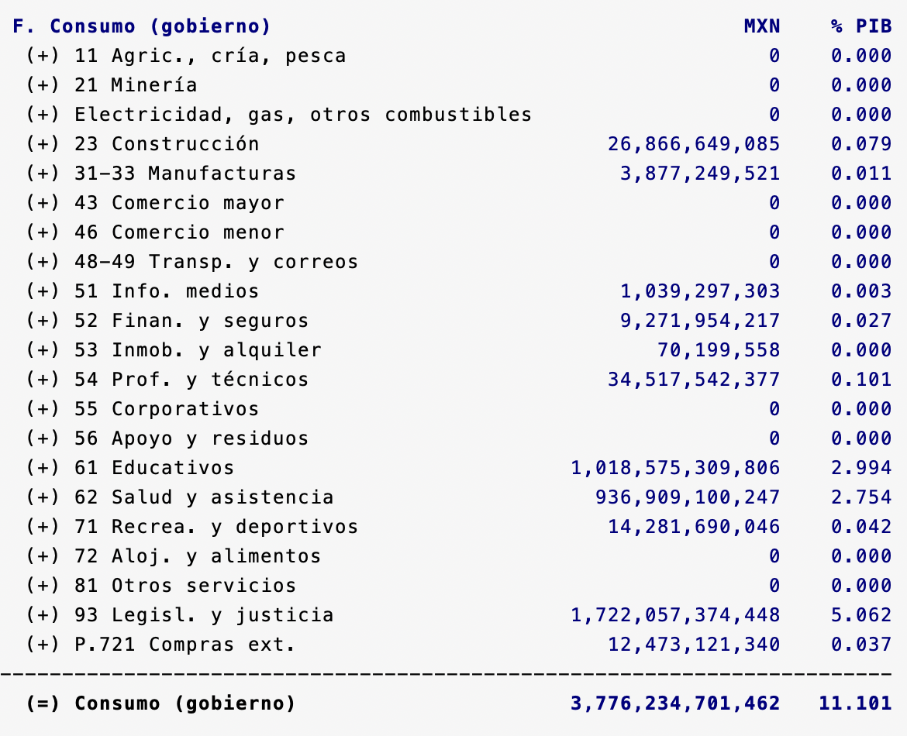
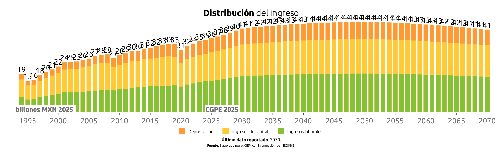
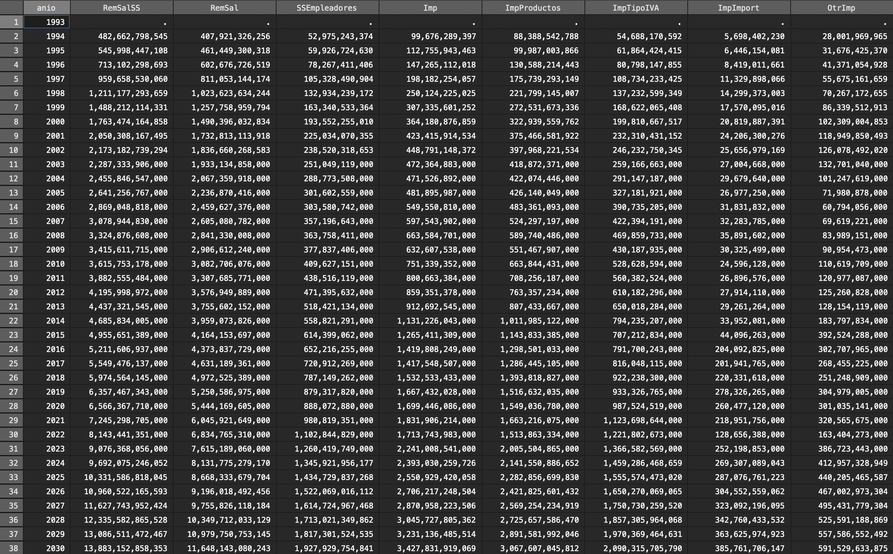

# Simulador Fiscal CIEP v5.3: Sistema de Cuentas Nacionales

Versión: 21 de febrero de 2025

## SCN.ado
**Descripción:** Ado-file (.ado) diseñado para automatizar el análisis y proyección de datos del Sistema de Cuentas Nacionales (SCN). 

**Alcance:** Para abordar las limitaciones en la disponibilidad de información, se implementó un modelo que combina un *pastcast* para estimar datos históricos y un *forecast* para proyectar datos futuros. Como resultado, el programa presenta una base de datos integral del SCN, con información abarcando desde 1993 hasta 2070. 

  
**Esta es la información que encontrarás aquí**

  
* **Cuenta de producción bruta:** Presenta el cálculo del PIB utilizando el método del valor agregado, considerando la producción total menos el consumo intermedio. 
* **Cuenta de distribución del ingreso:** Desglosa el PIB a través de los ingresos de asalariados, las ganancias de las empresas y el consumo de capital fijo.
* **Cuenta de los ingresos del capital:** Examina las ganancias de las empresas. 
* **Distribución secundaria del ingreso:** Contabiliza los ingresos disponibles para el país.
* **Utilización del ingreso disponible**  Calcula el ingreso nacional disponible utilizando el método del gasto. Se obtiene sumando el consumo de los hogares, el gasto del gobierno, las importaciones netas y el ahorro bruto, lo que genera el PIB. Restando el consumo de capital fijo, se obtiene el Ingreso Nacional Disponible.
* **Consumo de los hogares:** Desglosa el gasto de los hogares en bienes y servicios.
* **Consumo Gobierno:** Detalla el gasto público en bienes y servicios.
*  **Cuenta de actividad económica:**  Calcula el PIB por el método del valor agregado, de cada sector productivo e incorporando los impuestos sobre los bienes y servicios. 

<h3 style="color: #ff7020;">1. Input:</h3>

En este programa se integran dos bases de datos:

1. BIE:  Proporciona datos sobre el ingreso, la producción bruta, la cuenta de ingreso nacional disponible, el consumo de los hogares, el gasto de consumo privado, el gasto de consumo del gobierno y el PIB por actividad económica. [^1] 

2. CSI: Proporciona información sobre el ingreso mixto bruto, las cuotas a la seguridad social, los subsidios a los productos, la producción e importaciones y los excedentes de operación.[^2]

<h3 style="color: #ff7020;">2. Sintaxis:</h3>

Para extraer los datos, es necesario ingresar el prompt en la consola siguiendo esta sintaxis:

`SCN [, ANIO(int) ANIOMax(int) NOGraphs UPDATE]`

Para crear comandos de manera automática y evitar errores de sintaxis, utiliza nuestra calculadora de prompts.

    <h4 style="border-bottom: 2px solid black; display: inline-block;">Calculadora de Prompts</h4>

**A. Opciones disponibles:**
<!-- Opciones para PIBDeflactor -->

  <label for="anio">Año Inicial:</label>
  <input 
    type="number" 
    id="anio" 
    placeholder="Ej. 2024" 
    oninput="actualizarComando()"
  >

  <label for="aniomax">Año Máximo:</label>
  <input type="number" id="aniomax" placeholder="Ej. 2070" oninput="actualizarComando()">

  <label for="noGraphs">Sin gráficos:</label>
  <input type="checkbox" id="noGraphs" onchange="actualizarComando()">

  <label for="update">Actualizar base:</label>
  <input type="checkbox" id="update" onchange="actualizarComando()">

<strong>Copia y pega este comando en la consola:</strong>

<pre id="códigoComando">SCN</pre>

<h3 style="color: #ff7020;">3. Output:</h3>

Tras ingresar el prompt, el código devolverá tres elementos. La ventana de resultados, dos gráficas y una base de datos. A diferencia de otros programas, consideramos que la ventana de resultado es el principal elemento de interés para el usuario.

**1. Ventana de Resultados:** Muestra un resumen del Sistema de Cuentas Nacionales. En total, encontrarás ocho tablas.

 

  
Método de valor agregado (Tabla A y G):

Descripción: 
La tabla muestra cómo se calcula el PIB desde el valor agregado. Se obtiene restando el consumo intermedio a la producción bruta y sumando los impuestos a los productos.

 

Descripción:
La tabla desglosa el PIB por sector económico, mostrando la contribución de cada actividad al valor agregado bruto.

  

  
  

  
Método del ingreso (Tabla B1, B2, C y D):

Descripción: 
La tabla muestra cómo se calcula el PIB desde la distribución del ingreso, desglosando la participación del trabajo y el capital. 

Descripción:
La tabla muestra la composición de los ingresos de capital en la economía, incluyendo ganancias empresariales, ingreso mixto y alquileres imputados.

Descripción:
La tabla muestra cómo se transforma el PIB en ingreso nacional disponible a través de la distribución secundaria del ingreso.

Descripción:
La tabla muestra cómo se distribuye el ingreso nacional disponible entre consumo, ahorro y otras transacciones

  
 

 

  
Método del consumo (Tabla E y F):

Descripción: 
La tabla desglosa el consumo de los hogares e ISFLSH en diferentes categorías de bienes y servicios.

Descripción: 
La tabla muestra la distribución del gasto del gobierno en bienes y servicios, destacando su inversión en sectores clave como educación, salud y justicia.

  
 
  
**2. Gráficas:** Representación visual del PIB.

PIB por el método de ingreso:
 

PIB por el método de consumo:
 

**3. Base de datos:**  Permite al usuario obtener una base recortada y limpia para hacer sus propios análisis.

[^1]: **Link:** [Banco de Indicadores](https://www.inegi.org.mx/app/indicadores/) 

