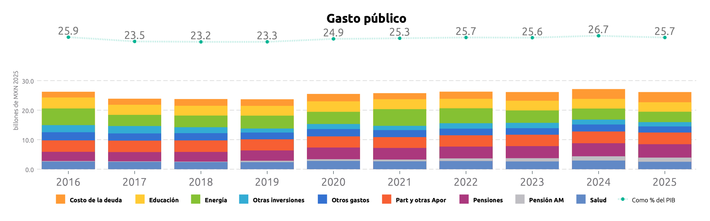
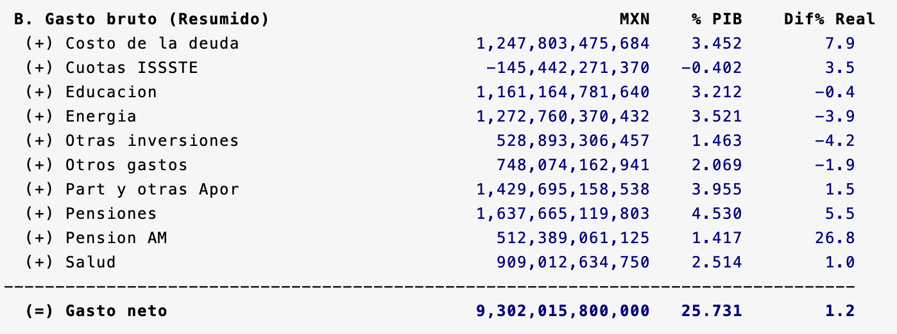

# Simulador Fiscal CIEP: Presupuesto de Egresos de la Federación (PEF)
Versión: 6 de marzo de 2025

<hr style="border: none; height: 2px; background-color: #ff7020;">


## PEF.ado
**Descripción:** *Ado-file* diseñado para automatizar la extracción y el análisis de datos del Presupuesto de Egresos de la Federación (PEF). Este programa permite extraer y analizar analizar automáticamente los datos oficiales del gasto público publicados por la SHCP. También se utilizan datos del INEGI para cálculos adicionales.



**Alcance:** Permite consultar el gasto histórico desde 2013 hasta el año actual. Se desglosa la distribución del gasto en salud, educación, seguridad y otros sectores. Además, podrás evaluar su relación con el PIB.

<h3 style="color: #ff7020;">1. Input:</h3>

En este programa se utilizan tres fuentes de datos: 

1. Cuenta Pública: Contiene la distribución de los recursos públicos ejercidos en el gasto del gobierno federal.
2. Presupuesto de Egresos de la Federación: Es el documento que detalla la distribución de los recursos públicos aprobada para el gasto del gobierno federal. Estos datos se utilizan cuando la cuenta pública todavía no ha sido públicada.
3. BIE: Proporciona datos sobre el PIB, el deflactor de precios, la inflación y el empleo. [^2] 

<h3 style="color: #ff7020;">2. Sintaxis:</h3>

<div style="text-align: center;">
    <h4 style="border-bottom: 2px solid black; display: inline-block;">Calculadora de Prompts</h4>
</div>

<!-- A. Opciones disponibles -->
<!-- Opción 1: Año Base -->
<div>
  <label for="anioVp">Año Base:</label>
  <input 
    type="number" 
    id="anioVp" 
    placeholder="Ej. 2024" 
    oninput="actualizarComando()">
</div>

<!-- Opción 2: Año de comparación -->
<div>
  <label for="desde">Año de comparación:</label>
  <input 
    type="number" 
    id="desde" 
    placeholder="Ej. 2013" 
    oninput="actualizarComando()">
</div>

<!-- Se ha eliminado la opción de manejo de datos faltantes -->

<!-- Opción 3: Sin gráficos -->
<div>
  <label for="noGraphs">Sin gráficos:</label>
  <input type="checkbox" id="noGraphs" onchange="actualizarComando()">
</div>

<!-- Opción 4: Actualizar base -->
<div>
  <label for="update">Actualizar base:</label>
  <input type="checkbox" id="update" onchange="actualizarComando()">
</div>

<!-- Opción 5: Solo base -->
<div>
  <label for="base">Solo base:</label>
  <input type="checkbox" id="base" onchange="actualizarComando()">
</div>

<details>
  <summary>**Descripción de opciones**:</summary>
  
  * Año Base (anio): Cambia el año de referencia. 
  * Año de comparación (desde): Especifica el año con el que se compararán los datos.
  * Sin Gráficos (nographs): Evita la generación de gráficas.
  * Actualizar Base (update): Corre un do-file para obtener los datos más recientes.
  * Solo Base (base): Permite descargar únicamente la base de datos sin aplicar cálculos adicionales.

  
</details>

<!-- Personalización de gráfica -->
<div style="text-align: center;">
    <h4 style="border-bottom: 2px solid black; display: inline-block;">Personalización de gráfica</h4>
</div>

<!-- Opción 6: Rango mínimo -->
<div>
  <label for="minimum">Rango mínimo:</label>
  <input type="number" id="minimum" step="0.1" placeholder="Ej. 0.5" oninput="actualizarComando()">
</div>

<!-- Opción 7: Filas -->
<div>
  <label for="rows">Filas:</label>
  <input type="number" id="rows" placeholder="Ej. 1" oninput="actualizarComando()">
</div>

<!-- Opción 8: Columnas -->
<div>
  <label for="cols">Columnas:</label>
  <input type="number" id="cols" placeholder="Ej. 5" oninput="actualizarComando()">
</div>

<!-- Opción 9: Título -->
<div>
  <label for="title">Título:</label>
  <input type="text" id="title" placeholder="Ej. Ingresos Fiscales" oninput="actualizarComando()">
</div>

<details>
  <summary>**Descripción de opciones de Personalización de gráfica**:</summary>
 
   * Rango mínimo (minimum): Define el porcentaje mínimo del PIB que un concepto de gasto debe alcanzar para ser visualizado en la gráfica. A mayor valor, mayor cantidad de conceptos caen dentro del rubro "otros".
   * Filas (rows): Número de filas en la leyenda de la gráfica.
   * Columnas (cols): Número de columnas en la leyenda de la gráfica.
   * Título (title): Título de la gráfica.
   
</details>

<p><strong>Copia y pega este comando en la consola:</strong></p>
<pre id="códigoComando">PEF</pre>

<script>
  function actualizarComando() {
    // Obtiene los valores de cada opción
    var anioVp   = document.getElementById("anioVp").value;
    var desde    = document.getElementById("desde").value;
    var noGraphs = document.getElementById("noGraphs").checked;
    var update   = document.getElementById("update").checked;
    var base     = document.getElementById("base").checked;
    
    // Obtiene los valores de Personalización de gráfica
    var minimum  = document.getElementById("minimum").value;
    var rows     = document.getElementById("rows").value;
    var cols     = document.getElementById("cols").value;
    var title    = document.getElementById("title").value;
    
    // Comando base
    var comando = "PEF";
    
    // Construye las opciones adicionales
    var opciones = "";
    if(anioVp)   { opciones += " anio(" + anioVp + ")"; }
    if(desde)    { opciones += " desde(" + desde + ")"; }
    if(noGraphs) { opciones += " nographs"; }
    if(update)   { opciones += " update"; }
    if(base)     { opciones += " base"; }
    
    // Agrega las opciones de Personalización de gráfica
    if(minimum)  { opciones += " minimum(" + minimum + ")"; }
    if(rows)     { opciones += " rows(" + rows + ")"; }
    if(cols)     { opciones += " cols(" + cols + ")"; }
    if(title)    { opciones += " title(" + title + ")"; }
    
    // Agrega las opciones al comando si se definió alguna
    if(opciones.trim() !== "") {
       comando += "," + opciones;
    }
    
    // Actualiza el <pre> con el comando final
    document.getElementById("códigoComando").textContent = comando;
  }
</script>


<h3 style="color: #ff7020;">3. Output:</h3>

Tras ingresar el prompt, el código devolverá tres elementos. La ventana de resultados, tres gráficas y una base de datos. 

**1. Ventana de Resultados:** Muestra 3 tablas con información de los egresos de la federación.

Tabla A Gasto Bruto: Presenta el Gasto Bruto en volumen total, porcentaje del PIB y participación relativa dentro del gasto total.


Tabla B Gasto Neto (resumido): Presenta el gasto neto en volumen total, porcentaje del PIB y el crecimiento real desde la fecha de comparación.


Tabla C Cambios: Muestra las diferencias de los gastos en porcentaje del PIB entre los dos periodos seleccionados.


**2. Gráficas:** Muestra la composición del gasto público por año.


**3. Base de Datos:** Permite obtener una base de datos recortada y limpia para hacer sus propios análisis. 


<details>
  <summary>**Información sobre la base de datos**</summary>
  
 1. Información sobre los valores: Todos los montos en la base de datos son en valor nominal, salvo que se indique lo contrario. La información de las cifras proviene directamente de fuentes públicas.
 2. En el caso de que selecciones la opción 
`solo base`, el programa te devolvera una base de datos sin ningún tipo de procesamiento. Se desplegará exactamente igual que en fuentes públicas. Consideramos que esta es una buena opción si quieres empezar tus análisis desde cero. 

</details>

## Sintaxis completa (documentación técnica)

```stata
PEF [if] [, ANIO(int año_actual) BY(varname) UPDATE NOGraphs Base MINimum(real 1) DESDE(int año_actual-9) PEF PPEF APROBado ROWS(int 1) COLS(int 5) HIGHlight(int 0) TITle(string)]
```

### Opciones técnicas no documentadas anteriormente:

- **BY(varname)**: Variable para agrupar el gasto público. Opciones principales:
  - `divCIEP`: División CIEP (predeterminado) - clasificación por función
  - `ramo`: División por ramo presupuestario  
  - `funcion`: División por función de gobierno
  - `capitulo`: División por capítulo de gasto (objeto del gasto)
  - Cualquier variable de agrupación en la base de datos

- **PEF/PPEF/APROBado**: (Opciones internas) Jerarquía de datos presupuestarios:
  - Prioridad: Ejercido > Aprobado > Proyecto
  - El sistema selecciona automáticamente la mejor información disponible

- **HIGHlight(int 0)**: Destacar una categoría específica en el gráfico (por número de orden)

## Dependencias

### Programas .ado requeridos:
- **`PIBDeflactor.ado`**: Para obtener PIB, deflactor y ajustar series fiscales
- **`UpdatePEF.do`**: Para actualizar datos desde fuentes oficiales

### Archivos de datos requeridos:
- **`04_master/PEF.dta`**: Base consolidada de gastos públicos históricos
- **`01_raw/PEF.dta`**: Datos crudos de presupuestos y cuenta pública
- Archivos Excel de cuentas públicas anuales (descarga automática)

### Variables globales utilizadas:
- **`$pais`**: Nombre del país para títulos
- **`$id`**: Identificador de usuario para rutas personalizadas
- **`$paqueteEconomico`**: Etiqueta del escenario económico oficial
- **`$export`**: Ruta para exportar gráficos (si está definida)

## Cálculos y metodología técnica

### 4.1 Jerarquía de datos presupuestarios:
```stata
// Orden de prioridad para variable "gasto":
gasto = ejercido                              // Primero: gasto ejercido (Cuenta Pública)
replace gasto = aprobado if ejercido == .     // Segundo: gasto aprobado (PEF original)
replace gasto = proyecto if aprobado == .     // Tercero: proyecto de presupuesto (PPEF)
```

### 4.2 Clasificación de transferencias:
```stata
// Transferencias del Gobierno Federal (se excluyen del gasto neto):
transf_gf = (ramo == 19 & ur == "gyn") | (ramo == 19 & ur == "gyr")
```

### 4.3 Gasto programable vs no programable:
```stata
// No programable: participaciones, costo de deuda
noprogramable = (ramo == 28) | (capitulo == 9)
```

### 4.4 Valores como porcentaje del PIB:
```stata
variable_PIB = (variable / pibY) * 100
```

### 4.5 Cálculo de tasas de crecimiento real:
```stata
tasa_real = ((gasto_final/deflator_final) / (gasto_inicial/deflator_inicial))^(1/num_años) - 1
```

## Inputs (archivos de entrada)

### Estructura de `04_master/PEF.dta`:
Variables principales:
- **Identificadores**: `anio`, `ramo`, `ur`, `pp`, `eje`, `funcion`, `capitulo`
- **Descriptivas**: `nombre_ramo`, `nombre_pp`, `nombre_funcion`, `desc_capitulo`
- **Monetarias**: `ejercido`, `aprobado`, `proyecto`, `modificado`, `devengado`, `pagado`
- **Calculadas**: `gasto` (jerarquía: ejercido>aprobado>proyecto)
- **Clasificatorias**: `divCIEP`, `transf_gf`, `noprogramable`

### Clasificaciones de gasto:

#### Por División CIEP (divCIEP) - Función:
1. **Salud**: Servicios de salud, IMSS, ISSSTE
2. **Educación**: Educación básica, media superior, superior
3. **Pensiones**: Jubilaciones y pensiones
4. **Energía**: Subsidios energéticos, CFE, PEMEX
5. **Seguridad**: Defensa, seguridad pública
6. **Desarrollo social**: Programas sociales, combate a la pobreza
7. **Infraestructura**: Transporte, comunicaciones, obra pública
8. **Otros**: Funciones no clasificadas en anteriores

#### Por Ramo presupuestario (principales):
- **Ramo 7**: SEDENA (Secretaría de la Defensa Nacional)
- **Ramo 19**: Aportaciones a Seguridad Social
- **Ramo 28**: Participaciones a entidades federativas
- **Ramo 33**: Aportaciones federales
- **Ramo 50**: IMSS
- **Ramo 51**: ISSSTE  
- **Ramo 52**: PEMEX
- **Ramo 53**: CFE

## Outputs (archivos y variables generadas)

### Archivos exportados:
1. **Gráficos**:
   - `05_graphs/gastos{by}PIB.gph`: Archivo de gráfico de Stata
   - `$export/gastos{by}PIB.png`: Archivo PNG (si $export está definida)

2. **Bases de datos**:
   - Dataset en memoria con variables procesadas
   - `04_master/PEF.dta`: Base actualizada (si se usa `update`)

### Variables en dataset final:
- **Monetarias básicas**: `ejercido`, `aprobado`, `proyecto`, `modificado`, `gasto`
- **Como % del PIB**: `gastoPIB`, `ejercidoPIB`, `aprobadoPIB`
- **Ajustadas por inflación**: `gastoR` (valores reales)
- **Del PIB**: `pibY`, `indiceY`, `deflator`, `lambda`, `Poblacion`
- **Clasificatorias**: `divCIEP`, `ramo`, `funcion`, `capitulo`, `transf_gf`, `noprogramable`
- **Agrupación**: variable según opción `by` y `resumido` (colapsada según `minimum`)

### Scalars de retorno principales:

#### Totales agregados:
- **`r(Gasto_bruto)`**: Total del gasto bruto del año analizado
- **`r(Aportaciones_a_Seguridad_Social)`**: Aportaciones federales a seguridad social
- **`r(Cuotas_ISSSTE)`**: Cuotas del ISSSTE

#### Por categoría funcional (ejemplos con divCIEP):
- **`r(Salud)`**: Gasto total en salud
- **`r(Educacion)`**: Gasto total en educación  
- **`r(Pensiones)`**: Gasto en jubilaciones y pensiones
- **`r(Energia)`**: Subsidios y gasto energético
- **`r(Seguridad)`**: Gasto en defensa y seguridad pública
- **`r(Desarrollo_social)`**: Programas de desarrollo social
- **`r(Infraestructura)`**: Inversión en infraestructura
- **`r(Otros)`**: Otros gastos no clasificados

#### Por ramo presupuestario (si BY(ramo)):
- **`r(SEDENA)`** o **`r(Ramo_7)`**: Secretaría de la Defensa Nacional
- **`r(IMSS)`** o **`r(Ramo_50)`**: Instituto Mexicano del Seguro Social
- **`r(ISSSTE)`** o **`r(Ramo_51)`**: Instituto de Seguridad y Servicios Sociales
- **`r(PEMEX)`** o **`r(Ramo_52)`**: Petróleos Mexicanos
- **`r(CFE)`** o **`r(Ramo_53)`**: Comisión Federal de Electricidad

#### Control de errores:
- **`r(rc)`**: Código de retorno ("NoData" si no hay información para el año)

### Variables de retorno (locales):
- Lista de categorías según agrupación utilizada (ej: `r(divCIEP)`, `r(ramo)`)

## Tablas generadas en pantalla

### Tabla A - Gasto Bruto:
Para el año analizado muestra:
- Montos absolutos en moneda local
- Porcentaje del PIB  
- Porcentaje del gasto total

### Tabla B - Gasto Neto (resumido):
Excluye transferencias del Gobierno Federal:
- Montos netos
- Porcentaje del PIB
- Crecimiento real desde año de comparación

### Tabla C - Cambios:
Comparativo entre períodos:
- Diferencias en puntos porcentuales del PIB
- Cambios estructurales en composición del gasto

## Ejemplos prácticos actualizados

### Ejemplo 1: Análisis básico del gasto público
```stata
PEF, anio(2024) desde(2015)
```

### Ejemplo 2: Análisis por ramo presupuestario
```stata
PEF, anio(2024) by(ramo) minimum(0.5)
```

### Ejemplo 3: Análisis de funciones de gobierno
```stata
PEF, anio(2024) by(funcion) minimum(1.0)
```

### Ejemplo 4: Gráfico personalizado con destacado
```stata
PEF, anio(2024) title("Gasto Social 2024") highlight(1) rows(2) cols(4)
```

### Ejemplo 5: Solo datos, sin gráficos
```stata
PEF, anio(2024) nographs nooutput
```

### Ejemplo 6: Actualizar datos y generar base cruda
```stata
PEF, update base
// Obtiene datos más recientes sin procesamiento
```

### Ejemplo 7: Análisis de período específico
```stata
PEF if anio >= 2020 & anio <= 2024, by(divCIEP) minimum(2.0)
```

## Ver también

### Programas relacionados:
- **`PIBDeflactor`**: Proporciona series macroeconómicas para ajustes
- **`UpdatePEF`**: Actualiza datos desde fuentes oficiales (SHCP, Transparencia)
- **`LIF`**: Analiza ingresos públicos (contraparte de gastos)
- **`FiscalGap`**: Utiliza proyecciones de PEF para análisis de brecha fiscal
- **`SHRFSP`**: Analiza requerimientos de financiamiento del sector público

### Archivos de configuración:
- **`profile.do`**: Define identificador de usuario ($id) y parámetros globales

## Notas técnicas actualizadas

### Jerarquía de información presupuestaria:
1. **Ejercido** (Cuenta Pública): Gasto realmente ejecutado - más confiable
2. **Aprobado** (PEF): Presupuesto originalmente aprobado por el Congreso
3. **Proyecto** (PPEF): Propuesta del Ejecutivo antes de aprobación

### Manejo de transferencias intergubernamentales:
- **Gasto Bruto**: Incluye todas las erogaciones federales
- **Gasto Neto**: Excluye transferencias a otros niveles de gobierno (evita doble contabilización)
- **Transferencias GF**: Aportaciones y participaciones federales (Ramo 28, 33, parte del 19)

### Clasificación automática "Otros":
- Categorías con participación menor a `minimum` % del PIB se agrupan automáticamente
- Útil para simplificar visualizaciones con muchas categorías pequeñas
- Balanceo entre detalle y claridad

### Validaciones y controles de calidad:
- Verifica existencia de información para años solicitados
- Devuelve código `r(rc) = "NoData"` si no hay información
- Maneja automáticamente missing values en series incompletas
- Ajusta períodos de comparación según disponibilidad de datos

### Rendimiento y compatibilidad:
- **Dataset típico**: 2,000-10,000 observaciones (depende del nivel de detalle)
- **Tiempo de ejecución**:
  - Sin actualización: 5-15 segundos
  - Con actualización: 30-180 segundos (descarga archivos Excel)
  - Con gráficos: +10-15 segundos adicionales
- **Memoria**: 20-50 MB para datasets completos con detalle máximo
- **Stata**: Versión 14 o superior requerida
- **Internet**: Necesario para actualización de datos

### Limitaciones conocidas:
- Datos históricos limitados a partir de 2013 (cambio metodológico)
- Algunas categorías pueden tener clasificaciones inconsistentes entre años
- Archivos de Cuenta Pública pueden tener retrasos de publicación
- Reclasificaciones presupuestarias pueden afectar comparabilidad histórica

[^1]: **Link:** [Sitio Web Transparencia](https://www.transparenciapresupuestaria.gob.mx/Datos-Abiertos) 

[^2]: **Link:** [Presupuesto de Egresos](https://www.ppef.hacienda.gob.mx/) 

[^3]: **Link:** [Banco de Indicadores](https://www.inegi.org.mx/app/indicadores/) 

